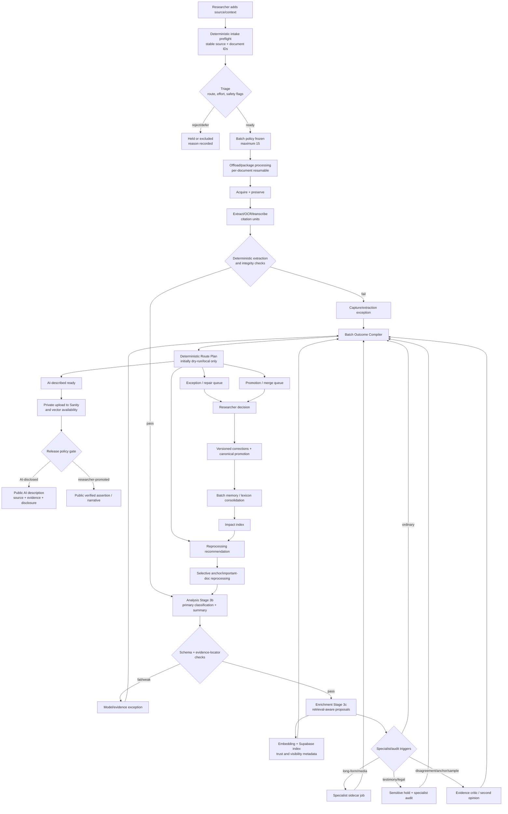

# SurvivingSOGICE: Independent Deep-Research Architecture Review

**Date:** 10 July 2026  
**Perspective:** independent senior AI systems architecture, digital-humanities infrastructure, archival media, and human–AI workflow design  
**Scope:** current documented implementation, proposed Workflow v2, external research, solo-researcher feasibility, compute constraints, archival ethics, retrieval/memory design, publication automation, and next implementation  

> **Important verification limit.** The supplied materials include operational documentation, prompts, architecture notes, and a system review, but not the SurvivingSOGICE `runner/` source tree, tests, schemas, database migrations, or live corpus. Therefore, claims about implementation are **documentation-verified, not independently source-code-verified**. I inspected source code only for the external Detrans.ai reference repository. Where project documents disagree, I privilege the root README and operations runbook, then `CLAUDE.md`, in line with the project's own documentation-precedence rule. [P1, §“Documentation precedence”]

---

## 1. Executive verdict

### What SurvivingSOGICE should become

SurvivingSOGICE should become a **local-first, provenance-first archival research operating system with exception-based human authority**. Its core product is not a chatbot, a graph database, an agent swarm, or a public WebXR experience. Its core product is a dependable chain from source capture to evidence-linked AI description, provisional research memory, human promotion of consequential assertions, and reversible public projection.

The strongest existing design decision is the separation of roles:

- **Triage** routes work and risk.
- **Analysis (Stage 3b)** creates a primary document description and classification.
- **Enrichment (Stage 3c)** proposes corpus-level terminology, entities, practices, claims, and relationships.
- **Deterministic audits** verify schemas, locators, provenance, state, and integrity.
- **Humans** retain authority over consent, legal interpretation, canonical identity, public network/funding claims, corrections, and scholarly narrative.

This is methodologically stronger than a single “smart” prompt. It also fits the available MacBook + Mac Studio/LiteLLM setup and the fixed maximum batch of 15. [P7, §“Stage contracts”; P3, §“Compute Reality”]

### What it should not become

It should not become:

1. a chat-first public product;
2. a chain in which every document receives every possible model pass;
3. a system that treats agreement between closely related models as verification;
4. a graph whose edges appear factual merely because they are visually connected;
5. a workflow that requires the researcher to approve every summary, tag, or proposal;
6. a remote-first CMS in which local source and audit artifacts can be silently overwritten;
7. a new orchestration framework, graph database, or paid service added before a measured bottleneck requires it.

The public archive, visualizations, and storytelling experiments should be **projections over explicit trust states**, never the place where research state is created or repaired.

### Is Workflow v2 directionally correct?

**Yes, but only after a significant sequencing correction.** Workflow v2 is right about the labor model: batch-level policy, selective audits, provisional memory, two publication lanes, retrieval-linked evidence, and human attention reserved for exceptions. It is also right that corpus growth does not improve later model runs until retrieval, corrections, and versioned memory are actually fed back into the pipeline. [P4, §§“Is this RAG?”, “The researcher’s five recurring actions”]

Its weak point is the proposed first milestone: **a full Batch Orchestrator plus automatic remote outcome routing is too large and too risky as the next step**. The current system already has multiple processing routes, offload packages, local/remote state boundaries, and a very large Streamlit/CLI surface. A new orchestrator that automatically schedules all specialist work and uploads ordinary records would combine execution, judgment, and publication policy before the system has one authoritative batch outcome contract, idempotent recovery, or retrieval-impact tracking.

### Most important correction to Workflow A

Workflow A's guarded offload and explicit dry-run/import sequence is a strength, not obsolete friction. Its main defect is that the researcher still encounters **separate lifecycle stages and proposal queues rather than one compiled batch outcome**. The correction is not to remove safeguards; it is to collapse routine status-reading into one deterministic, typed outcome artifact and one bounded exception/promotion inbox. [P6, §§“State Boundaries”, “After a Returned Package”]

A second correction is conceptual: the documentation alternates between “Sanity is the source of truth” and “local corpus contains canonical processing artifacts.” These should be resolved by assigning authority per object:

- **Local corpus:** authoritative source capture, extracted text, citation units, model/audit versions, and immutable processing history.
- **SQLite source queue/job ledger:** authoritative operational queue and execution state.
- **Sanity:** authoritative reviewed registries and public-content projections, not raw archival truth.
- **Supabase:** rebuildable vector index and retrieval service.
- **Exports/graphs:** rebuildable projections.

### Most important correction to Workflow B

Split “orchestration” into three smaller concerns:

1. **Compile** what happened.
2. **Plan** the next route deterministically.
3. **Execute** only already-supported commands, with idempotent retries.

Do not initially make the router perform unattended Sanity publication. It should first write a dry-run `route_plan.json` and mark local states. Remote upload becomes automatic only after the researcher has approved a versioned release policy and several batches have demonstrated that the route criteria are stable, reversible, and correctly exclude sensitive/consequential material.

### Single best next implementation milestone

## Build a **Batch Outcome Compiler + Deterministic Route Planner v1**—not the full Orchestrator v2.

It should:

- consume the current queue, offload ledger, per-document sidecars, readiness checks, audits, and specialist-route flags;
- account for every document in a batch exactly once;
- emit one versioned `batch_outcome.json` and readable `batch_outcome.md`;
- assign typed outcomes such as `ordinary_ready`, `capture_exception`, `model_exception`, `sensitive_hold`, `promotion_candidate`, or `reprocess_recommended`;
- generate a dry-run route plan without remote writes;
- preserve current explicit import safeguards and the batch maximum of 15;
- expose one outcome in Streamlit rather than adding another disconnected review page.

This milestone removes repeated researcher labor immediately, creates the state contract needed for later retrieval and selective reprocessing, and has lower methodological risk than automatic upload or a public adapter. Retrieval-aware Enrichment should be the next data-quality slice built on top of it.

---

## 2. Evidence and method

### 2.1 Project files inspected

| ID | File | Evidentiary use | Assessment |
|---|---|---|---|
| P1 | `README.md` | Current operating principle, implemented features, daily workflow, two public lanes, authority map, documentation precedence | Current operational summary; strongest supplied project source |
| P2 | `SYSTEM_REVIEW_2026-07-10.md` | Live-corpus/test-count claims, review burden, monolith risk, delivered safeguards, backlog and roadmap | Current evaluative document, but some numeric claims are self-reported |
| P3 | `SOLO_RESEARCH_AGENT_SYSTEM_EXPLAINER.md` | Compute realism, proposed bounded agents, likely modules and workload logic | Explicit design proposal; not implementation evidence |
| P4 | `RESEARCHER_WORKFLOW_V2.md` | Target workflow, RAG gaps, route design, audit/memory loop, implementation table | Explicit target operating model, not present implementation |
| P5 | `PUBLIC_GRAPH_WEBXR_STRATEGY.md` | Internal/public graph boundary, public-safe adapter, 2D-before-3D sequencing | Planning document; public layer not implemented |
| P6 | `INGESTION_OPERATIONS_RUNBOOK.md` | Current lifecycle and state boundaries, dry-run import, long-form and knowledge-export behavior | Current operational source |
| P7 | `CLAUDE.md` | Stage contracts, scale policy, model/compute stack, build checklist, unresolved gaps | Current technical context, but contains checklist drift and older wording |
| P8 | `ENRICHMENT_PROMPT_v1.0.md` | Stage 3c role, runtime context, related-document gap, evidence requirements | Current prompt design; related-document retrieval explicitly absent unless wired |
| P9 | `Claude_Ingestion_Prompt.md` | Stage 3b schema and rules, candidate-discovery overlap, truncation and confidence fields | Prompt is operationally important but its Vercel instructions are stale |
| P10 | `ARCHITECTURE_LOCAL_RUNNER_v1.0.md` | Adopted local Python/Streamlit decision and stable-ID concept | Historical architecture decision; model stack, confidence calibration, and universal checkpoints are stale |

### 2.2 External sources consulted

The following are primary, authoritative, peer-reviewed, or documented-system sources. Direct links are included as requested.

| ID | Source | Relevance |
|---|---|---|
| E1 | Detrans.ai, [Prompts and architecture description](https://detrans.ai/en/prompts) | Reference example for corpus-grounded retrieval and source surfacing only |
| E2 | Detrans.ai open repository, [pjamessteven/social-project](https://github.com/pjamessteven/social-project) | Direct code inspection of retrieval tools, separate indices, caching, filters, and source metadata |
| E3 | Detrans.ai code, [`app/lib/agents/tools.ts`](https://github.com/pjamessteven/social-project/blob/1e66e69eea7b46a87be7f9076da0e783277b8b7e/app/lib/agents/tools.ts) and [`app/lib/agents/data.ts`](https://github.com/pjamessteven/social-project/blob/main/app/lib/agents/data.ts) | Transferable retrieval patterns; also reveals domain-specific and popularity-based ranking that should not transfer |
| E4 | Lewis et al. (2020), [Retrieval-Augmented Generation for Knowledge-Intensive NLP Tasks](https://arxiv.org/abs/2005.11401) | Foundational distinction between parametric model memory and explicit retrievable memory/provenance |
| E5 | Wallat et al. (2024), [Correctness is not Faithfulness in RAG Attributions](https://arxiv.org/abs/2412.18004) | Citations may support an answer without proving the model actually relied on them; source display alone is insufficient |
| E6 | Society of American Archivists, [DACS Statement of Principles](https://saa-ts-dacs.github.io/dacs/04_statement_of_principles.html) | Archival description must state what is known/unknown/how known, document interventions, and remain iterative |
| E7 | W3C, [PROV-O](https://www.w3.org/TR/prov-o/) | Lightweight standard model for entities, activities, agents, derivation, and provenance interchange |
| E8 | W3C, [SKOS Reference](https://www.w3.org/TR/skos-reference/) | Multilingual labels, concept schemes, mapping strength, notes, and controlled-vocabulary design without pretending the thesaurus is world truth |
| E9 | NIST, [AI RMF Generative AI Profile, NIST AI 600-1](https://nvlpubs.nist.gov/nistpubs/ai/NIST.AI.600-1.pdf) | Risk-based monitoring, provenance, incident/correction processes, human feedback, and deployment controls |
| E10 | Cormack & Grossman (2015), [Autonomy and Reliability of Continuous Active Learning for Technology-Assisted Review](https://arxiv.org/abs/1504.06868) | Supports prioritizing human assessment rather than reviewing a large collection uniformly; not a direct validation recipe for LLM tagging |
| E11 | Huang et al. (2023), [Large Language Models Cannot Self-Correct Reasoning Yet](https://arxiv.org/abs/2310.01798) | Intrinsic self-correction without external evidence can fail or degrade performance |
| E12 | Manakul et al. (2023), [SelfCheckGPT](https://arxiv.org/abs/2303.08896) | Sampling disagreement can be a useful risk signal, but is not external factual verification |
| E13 | Wu et al. (2024), [LLMs Can Self-Correct with Key Condition Verification](https://arxiv.org/abs/2405.14092) | Verification improves when the critic has a targeted, externally checkable condition rather than a generic “review yourself” prompt |
| E14 | Shumailov et al. (2024), [AI models collapse when trained on recursively generated data](https://www.nature.com/articles/s41586-024-07566-y) | Analogy for why original human/source evidence must remain distinguishable from accumulated model output; this project is not model training, so the analogy is limited |
| E15 | Ruest et al. (2020), [The Archives Unleashed Project](https://arxiv.org/abs/2001.05399) | Digital-humanities example of filter–extract–aggregate–visualize and reusable derivative products rather than one monolithic interface |
| E16 | Speck et al. (2014), [European Holocaust Research Infrastructure](https://arxiv.org/abs/1405.2407) | Distributed archival descriptions, integration across collections, and research infrastructure as more than a search UI |
| E17 | García-González et al. (2025), [EHRI Data Integration Lab](https://arxiv.org/abs/2505.02455) | Recent lessons on lowering integration burden for small/micro-archives and treating data integration as technical and social work |
| E18 | EU GDPR, [Regulation (EU) 2016/679, Article 9](https://eur-lex.europa.eu/legal-content/EN/TXT/?uri=CELEX:02016R0679-20160504) | Sexual orientation and sex-life data are special-category personal data; testimony workflows require explicit legal/ethical governance |
| E19 | EU AI Act, [Regulation (EU) 2024/1689, Article 50](https://eur-lex.europa.eu/eli/reg/2024/1689/oj) | Relevant transparency baseline for AI interaction and public-interest AI-generated text; applicability requires project-specific legal review |

### 2.3 Method

I used three evidence labels throughout:

- **Repository/document fact:** stated in current project files and not contradicted by a higher-precedence supplied file.
- **External evidence:** supported by the sources above.
- **Inference/recommendation:** architectural judgment derived from the first two; it is labelled as such and should be tested in the repository.

Implementation classifications mean:

- **Implemented and usable:** current project documentation says it operates in the live workflow.
- **Implemented but fragmented:** components exist, but require separate commands/pages or do not share one outcome contract.
- **Partially implemented:** meaningful substrate exists, but the stated capability is incomplete.
- **Missing:** explicitly identified as not implemented or absent from all current sources.
- **Unnecessary/over-engineered:** would add maintenance without resolving a demonstrated bottleneck.
- **Unsafe or methodologically questionable:** could create misleading authority, irreversible publication, or false assurance without additional controls.

### 2.4 Important uncertainties and missing evidence

1. The actual SurvivingSOGICE Python source, tests, database schemas, migrations, and runtime logs were not supplied. Module names and test counts are therefore reported, not independently confirmed.
2. The README reports 1,887 tests, while the system review reports 1,880. This likely reflects rapid revision, but it confirms the need to generate health metrics rather than hand-maintain them. [P1, §“Current system”; P2, §“Executive assessment”]
3. The exact ordering of Enrichment versus remote upload is inconsistent: one document says Enrichment runs after confirmed upload, while Workflow A and current system descriptions imply it is part of source-worker/offload processing. This needs a code-level trace.
4. Live Supabase schema state is unclear. `CLAUDE.md` simultaneously states the 4096 dimension is resolved and that the table still needs recreation/testing. [P7, §“Phase 0-B”]
5. The actual public-lawful basis, retention schedule, consent language, and testimony withdrawal protocol were not supplied. This report is architectural, not legal advice.
6. No measured batch timing, exception rates, extraction-failure distribution, or model quality by language was supplied. Labor ranges below are scenario estimates, not observed productivity metrics.

---

## 3. Current versus proposed capability matrix

### 3.1 Detailed matrix

| Capability | Workflow A behavior | Workflow B proposal | Verified implementation status | Keep/change/remove recommendation | Researcher labor effect | Technical risk | Methodological/ethical risk |
|---|---|---|---|---|---|---|---|
| 1. Source queue and context | Researcher adds URLs/files, priority, notes, landing links, attachments | Same, plus batch research policy/question | **Implemented and usable** for queue/context; batch-policy object **missing** | Keep. Add a small versioned `batch_policy.json`, not a new planning app | Lowers re-entry; still requires scholarly source choice | Low | Low; relevance remains researcher-owned |
| 2. Stable source/document/evidence IDs | Stable document folders and citation units are documented | IDs become the basis of audit, retrieval, and reprocessing | **Implemented and usable**, documentation-verified | Keep. Add immutable source-capture ID distinct from mutable description version | Major long-term reduction in reconciliation work | Medium if IDs differ across queue/local/Sanity | High if merges rewrite or orphan provenance |
| 3. Triage as separate routing stage | Detects characteristics, model route, special flags, overnight safety | Assigns base + specialist routes and effort | **Implemented and usable** for flags/safety; route execution fragmented | Keep separate. Triage may recommend, never determine public truth | Reduces unnecessary heavy calls | Medium: false negatives in sensitive routing | High for missed testimony/legal sensitivity; retain fail-closed rules |
| 4. Guarded unattended batch, maximum 15 | Ordinary safe items only; special flags excluded | Up to 15 through base route, then specialist scheduling | **Implemented and usable** for guarded batch/offload | Keep maximum 15. Do not increase. Add per-document resumability and one outcome compiler | Strong labor reduction without excessive failure blast radius | Medium: partial batch failure, duplicate retry | Low if holds are fail-closed and states are explicit |
| 5. Source-offload package lifecycle | Export → Mac Studio → returned package → dry-run import → explicit import | Hidden behind orchestrator | **Implemented and usable** | Keep lifecycle and dry-run as safety boundary. Orchestrator should call it, not replace it | Some steps remain, but are valuable checkpoints | Medium: stale packages, mismatched versions | Low; explicit import protects evidence integrity |
| 6. Acquisition/preservation | Worker captures sources and records artifacts | Base route, deterministic checks | **Implemented and usable**, based on docs | Keep. Add capture checksum, source-family/copy ID, rights/retention fields | Automation absorbs repetitive work | Medium-high for blocked/dynamic sources | High for unlawful retention or false completeness claims |
| 7. Extraction/OCR/transcription | Preprocessing plus specialist media/long-form sidecars | Deterministic checks before models | **Implemented but fragmented** | Keep tools; centralize quality/integrity findings in one typed audit | Reduces manual transcription; bad captures remain costly | High across PDFs, OCR, subtitles, dynamic sites | High if summaries obscure missing pages/sections |
| 8. Citation units/evidence locators | Exist as sidecars and feed exports | Become retrieval and citation contract | **Implemented and usable**, but enforcement level unverified | Keep; make quote/locator verification deterministic and mandatory for consequential outputs | Saves re-finding passages | Medium: locator drift after re-extraction | High if citations are plausible but not faithful/supporting [E5] |
| 9. Analysis Stage 3b | Classification, evidence, summary, tags, uncertainty; compact trusted lexicon | Remains distinct sequential pass | **Implemented and usable** | Keep separate. Narrow candidate entity/lexicon discovery to hints; canonical proposal objects belong to Enrichment | Efficient document description | Medium: truncation, schema-valid hallucination | Medium-high: prompt currently encourages generous tactic tagging and overlaps with Enrichment |
| 10. Enrichment Stage 3c | Lexicon/entities/tactics/practices/claims, full memory; related docs usually absent | Retrieval-aware corpus intelligence | **Implemented and usable** as pass; retrieval part **missing** | Keep separate. Introduce retrieval here first, with source-level evidence and trust labels | Prevents repeated manual cross-document lookup | Medium: context overflow, duplicate proposals | High for false entity merges/network claims if provisional status is hidden |
| 11. Analysis → Enrichment sequencing | Complementary but exact worker/upload order is unclear | Explicit sequential passes | **Partially implemented/documented inconsistently** | Standardize local order: Analysis → deterministic evidence audit → Enrichment; remote upload must not be prerequisite | Removes confusing reruns | Medium migration risk | Low if original sidecars remain immutable |
| 12. Compact trusted lexicon in Analysis | Validated/researcher-trusted terms, capped | Same | **Implemented and usable** | Keep. Include definitions/scope notes and prior corrections, not provisional recurrence | Improves consistency with low context cost | Low | Medium if trusted lexicon freezes contested language; version and date it |
| 13. Fuller lexicon/registry in Enrichment | Draft + validated + entity registry | Plus provisional recurring memory and retrieved evidence | **Implemented and usable** for current memory; expanded feedback **missing** | Keep, but every memory item needs trust state and evidence count | Reduces duplicate proposals | Medium | High if AI repetition is counted as independent attestation |
| 14. Related corpus retrieval into Analysis | Not consistently injected | Retrieve reviewed terms/docs/quotes/corrections | **Missing** | Do **not** make broad pre-classification retrieval the first change. Run baseline Analysis independently; add bounded correction/term context or a post-analysis discrepancy check later | Can reduce inconsistencies but may increase review noise | Medium-high: retrieval errors, prompt size | High: confirmation bias and corpus self-reinforcement |
| 15. Related corpus retrieval into Enrichment | Prompt slot exists but is empty unless explicitly wired | Full retrieval-aware enrichment/deduplication | **Missing, but interface anticipated** | Build first retrieval use case. Retrieve quote-level evidence, canonical terms, entities, corrections, and limited related document profiles | High labor benefit | Medium: retrieval quality and versioning | Medium if provisional items are clearly labelled; high otherwise |
| 16. Deterministic schema/provenance/integrity checks | Many audits and manifest commands exist | Run before additional model calls | **Implemented but fragmented/substantially implemented** | Consolidate into one gate result with machine-readable failure codes | Reduces unnecessary model/human review | Low-medium | Low; deterministic checks should not be mistaken for semantic truth |
| 17. Evidence critic | No clearly unified pass; analysis/enrichment audits exist | Selectively checks support | **Partially implemented or missing as a distinct role** | Start deterministic: quote exists, locator resolves, field has evidence. Add model critic only for semantic entailment exceptions | Avoids universal extra calls | Medium | Same-model critic can create false reassurance [E11] |
| 18. Independent second opinion | Exists as separate workflow/command | Triggered by sensitive/disagreement/anchors/sample | **Implemented but fragmented** | Keep selective. Prefer different model family and different evidence/prompt; never “vote” by count | Bounded extra labor/cost | Medium-high compute | High if correlated models are described as independent verification |
| 19. Anchor-set audit | Commands/report documented; repeatable re-reading remains on checklist | System-version audit of selected hard/important cases | **Partially implemented** | Complete it. Treat outcomes as drift diagnostics, not confidence calibration or global accuracy | Small, predictable human burden | Medium | Low if selection rationale and coverage limits are explicit |
| 20. Long-form specialist route | Sidecars/review commands exist separately | Automatically scheduled from triage | **Implemented but fragmented** | Integrate only as a queued specialist job with per-section recovery; do not force every long document through one huge prompt | Reduces repeated navigation | High memory/context and partial failure | Medium: synthesis may erase section disagreement |
| 21. Media specialist route | Transcript/media annotation workflows exist separately | Automatically scheduled | **Implemented but fragmented** | Route only when transcript/media quality criteria met; preserve timecodes and source versions | Moderate labor reduction | High capture/transcription variability | High for misattributed speakers/edited media |
| 22. Testimony route | Candidate/deep-review workflow and holds exist | Private extraction + sensitivity audit; human consent/removal | **Implemented but fragmented; removal protocol missing** | Keep private and separate. No automatic public upload. Finish withdrawal/removal propagation before publication | Human workload remains necessary and bounded | High privacy/security | Very high; GDPR Article 9 and consent/withdrawal governance apply [E18] |
| 23. Legal route | Legal flags/review exist | Independent comparison + citation audit; human public interpretation | **Implemented but fragmented** | Keep; distinguish extraction of legal text from legal interpretation. Require jurisdiction/version/date | Human gate only for public legal meaning | Medium | Very high if model summaries are presented as legal conclusions |
| 24. Research annotation profiles | Separate commands/workflows | Triggered by batch question, not universal | **Implemented but fragmented** | Keep opt-in. Do not place in base ingestion route | Prevents costly irrelevant analysis | Low-medium | Medium if interpretive profile is confused with archival description |
| 25. Batch outcome compiler | Researcher refreshes worklist and checks several states | One compiled outcome | **Missing** | **Build next.** One typed artifact, all docs accounted once, no side effects | Largest immediate reduction in repeated status labor | Medium: mapping legacy states | Low; improves transparency |
| 26. Automatic outcome router | Manual import/review/upload/push | Auto-upload ordinary records; exceptions only | **Missing** | Build in stages: local state plan → dry-run remote plan → idempotent private upload → public release. Do not jump to publication | Potentially very high labor reduction | High: duplicate writes, incorrect state, rollback | High if a bad policy publishes sensitive or consequential claims |
| 27. Automatic local-corpus import | Explicit dry-run then import | Likely automatic ordinary path | **Implemented as explicit import; automation missing** | Retain dry-run. Auto-import only when package manifest, checksums, schema versions, and doc counts match; log rollback manifest | Small reduction; preserves high-value safeguard | Medium | Low |
| 28. Sanity document upload | Explicit upload after readiness/review | Automatic for policy-compliant ordinary records | **Implemented and usable manually** | Permit batch-policy approval rather than per-document clicks, but separate private upload from public visibility | Major scaling benefit | Medium-high: overwrite and state drift | Medium-high; public projection must exclude sensitive fields |
| 29. Supabase embedding upload | Upload/sync exists | Automatic | **Implemented and usable, schema state uncertain** | Automate after local evidence ID/checksum exists. Upsert idempotently. Store visibility/trust filters and embedding model/version | Eliminates repetitive work | Medium: dimension/model migrations | Medium: private text leakage through retrieval permissions |
| 30. AI-disclosed document layer | Publication-audit report exists; no publisher | Automatic ordinary public lane | **Partially implemented** | Keep concept. Require source link, AI disclosure, version, audit state, uncertainty, correction/retraction path, and no sensitive fields | Makes 4,000-doc publication feasible | Medium | Medium; DACS supports minimum description with transparent limits [E6] |
| 31. Researcher-verified layer | Human review/promotion occurs in separate tools | Canonical claims, edges, testimony, law, narratives | **Partially implemented** | Keep. Human promotion should create a new signed/versioned assertion, not mutate model output | Concentrates labor where it matters | Medium | Low if authority and evidence are explicit |
| 32. Batch memory/lexicon consolidator | Review-plan groups proposals but no closed-loop memory stage | Group, compare, challenge, retain provisional | **Partially implemented** | Build after retrieval context service. Deterministic normalization first; model challenge second; human promotion only at canonical boundary | Very high reduction in proposal backlog | Medium-high multilingual clustering | High for false equivalence and model-generated recurrence |
| 33. Prior corrections/audit memory | Sidecars and review overrides exist | Consumed in later runs | **Implemented but fragmented; feedback consumption missing** | Create a typed correction registry with field scope, evidence, authority, effective version, and invalidation | Avoids repeated known errors | Medium | High if old corrections are applied outside scope |
| 34. Selective reprocessing | Manual reanalyze commands/sidecars | Impact-driven anchors and important docs | **Partially implemented** | Add dependency index; never rewrite originals. Generate reprocessing candidates, not automatic corpus-wide reruns | Prevents huge future labor | Medium-high dependency tracking | Medium; changed interpretation must remain historically inspectable |
| 35. Evidence graph | Internal graph/export exists | Public graph over trust lanes | **Implemented and usable internally** | Keep as internal evidence graph. Add public-safe adapter before UI. No graph DB needed at 4,000 docs | Supports research without new manual entry | Medium | Very high for defamatory/causal implication from unreviewed edges |
| 36. Public-safe graph/search adapter | Planning document only | Later public RAG/search/story layer | **Missing** | Build after release policy and redaction/removal protocol; start with 2D/search, not WebXR/chatbot | Later public value; no immediate ingestion benefit | Medium | High if internal/provisional data leak |
| 37. Researcher semantic search/Q&A | Embeddings and semantic search exist | Richer evidence retrieval | **Implemented but fragmented/partially implemented** | Improve as an evidence-pack tool before building conversational QA | High scholarly benefit | Medium | Medium: answers must show retrieval set and omissions |
| 38. Public conversational RAG | Not present | Public-safe exploration | **Missing; premature** | Defer. Build non-chat evidence search and curated graph/timeline first | Avoids major moderation burden | High | High: conversational synthesis can overstate contested evidence |
| 39. One calm Streamlit cockpit | Many pages/worklists exist; main app reportedly very large | One exception dashboard | **Implemented but fragmented** | Refactor around the batch outcome contract; do not merely add a new page | Major cognitive-load reduction | Medium-high regression risk | Low |
| 40. New agent/orchestration framework | None required | Could be implied by “orchestrator” | **Unnecessary/over-engineered** | Use Python functions, typed artifacts, current CLI, and a small state machine. No LangGraph/Temporal/new service unless measured need emerges | Avoids maintenance burden | High for solo maintainer | Medium if opaque automation hides decisions |
| 41. New graph database | Current evidence graph is exported; Supabase/Sanity/local stack exists | Not required | **Unnecessary/over-engineered** | Do not add Neo4j or similar now. PostgreSQL/Sanity/local JSON are sufficient at this scale | Avoids duplicated truth stores | High integration burden | Medium: another graph store can diverge from evidence |
| 42. WebXR/3D public graph | Conceptual strategy | Later storytelling layer | **Missing and premature** | Freeze until public-safe contract, 2D usability, accessibility, and research question are proven | Protects thesis time | High frontend/maintenance | Medium-high: spatial proximity may imply unsupported relationships |

### 3.2 Corrections to Workflow A's summary

Workflow A is broadly accurate, with four corrections:

1. **Implementation claims are documentation-level, not code-verified in this review.**
2. **Exact Enrichment/upload ordering is unresolved.** `CLAUDE.md` says Enrichment runs after confirmed upload, while offload descriptions place it inside worker processing. The final workflow should make Enrichment local-first and independent of remote upload.
3. **“Human review for analysis” should not be read as universal per-document approval.** The current README explicitly limits human attention to promoted, recurring, sensitive, key-document, or consequential exceptions. [P1, §§“Start here”, “Human and AI responsibilities”]
4. **Sanity should not be described as the sole research source of truth.** It is the reviewed/public content store; local evidence and provenance artifacts must remain authoritative and reversible.

### 3.3 Stale or aspirational documentation

| Document/section | Stale or aspirational element | Correction |
|---|---|---|
| P10, §§“Local Model Strategy”, “Human-in-the-Loop Checkpoints”, “Phased Build Plan” | Claude-first/older small local models; four universal interactive pauses; confidence-threshold calibration; Vercel as near-term review UI | Superseded by Mac Studio/LiteLLM defaults, selective review, anchor audits, and Streamlit/local operation |
| P9, §“How to Use This File” | Says a Vercel app constructs the prompt and external output is imported into Vercel | Update to local runner/Streamlit and current prompt-loading path |
| P9, Analysis schema | Analysis emits candidate terms, actors, networks, and assets in addition to classification | Retain minimal discovery hints only; authoritative enrichment proposal objects should originate in Stage 3c to protect role boundaries |
| P9, Analysis rules | “TACTIC is the most important field. Be generous—3–5” | Replace quantity encouragement with evidence-linked inclusion criteria; otherwise the model is structurally pushed toward over-tagging |
| P8, system prompt input list | Says related documents are available | Runtime section correctly states the related-corpus block is empty unless retrieval is explicitly wired; treat the earlier statement as aspirational |
| P4, §“Recommended implementation order” | Full orchestrator + automatic router as first milestone | Replace with outcome compiler + dry-run route planner; add execution/upload only after state and recovery tests |
| P7, build checklist | Some items labelled unresolved despite current system/review claiming operation; model names and embedding versions vary across lines | Generate a machine-readable system manifest and remove hand-maintained “current” values from multiple docs |
| P2, numerical health claims | 1,880 tests versus README's 1,887; monolith sizes not independently verified | Generate health report from repository and timestamp it; treat narrative numbers as snapshots |

---

## 4. Recommended final workflow

### 4.1 Concise numbered workflow

1. **Create source candidate.** Researcher adds a URL/file and only the context that cannot be derived: why it matters, source relationship, priority, and any attached source file.
2. **Deterministic intake preflight.** Deduplicate URL/content, assign stable IDs, test access, record preservation/rights/retention metadata, and detect obvious format/language signals.
3. **Triage.** A small model plus deterministic rules assigns processing effort, specialist flags, and unattended-safety status. Triage never makes a publication or truth decision.
4. **Freeze a batch policy.** For no more than 15 documents, write a versioned policy: research purpose, allowed routes, models, disclosure lane, audit sample, and remote-write setting (`none`, `private_upload`, or later `public_release`).
5. **Package and process with per-document recovery.** Use the existing offload lifecycle. Every step writes a typed artifact and can resume without duplicating prior work.
6. **Acquire, preserve, extract, and create citation units.** Deterministic checks verify checksums, completeness signals, language, page/time coverage, and locator stability.
7. **Run Analysis (Stage 3b) independently.** Inputs: source text, metadata, triage flags, citation units, compact trusted lexicon, and scoped prior corrections. Do not inject provisional corpus hypotheses.
8. **Run deterministic Analysis evidence checks.** Confirm schema, allowed vocabulary, exact quote/locator existence, source coverage, and policy constraints. Failures become typed findings; no silent rewrite.
9. **Run Enrichment (Stage 3c).** Inputs: Analysis output, full trusted registry, retrieval context pack, related source evidence, prior corrections/audits, and clearly labelled provisional memory. Outputs remain proposals.
10. **Embed and index.** Upsert citation units/document profiles into Supabase with trust, sensitivity, visibility, checksum, language, and version metadata. Embeddings are derived and rebuildable.
11. **Run selective specialist/audit passes.** Trigger long-form/media/testimony/legal/critic/second-opinion/anchor work only when policy or evidence requires it.
12. **Compile one batch outcome.** Every document receives exactly one operational outcome plus zero or more findings/promotion candidates.
13. **Plan routes deterministically.** Ordinary records may become `ai_described_ready`; failures, sensitive material, disagreement, and consequential proposals enter bounded queues. Initial releases are dry-run only.
14. **Consolidate provisional memory at batch level.** Normalize variants, count independent source attestations, collect conflicts, challenge merges, and retain provisional status unless the researcher promotes a concept.
15. **Researcher reads one outcome and handles bounded exceptions.** Human work is source selection, sensitive/consequential decisions, promotion/merge questions, corrections, and research/story curation—not confirmation of routine model agreement.
16. **Upload/release by policy.** Private Sanity/Supabase upload and public release are different transitions. Public AI descriptions and researcher-verified assertions use different contracts.
17. **Record corrections, impacts, and selective reprocessing.** A correction invalidates affected projections and recommends anchors/important documents for reprocessing. Originals remain preserved.

### 4.2 Mermaid workflow



### 4.3 State transitions

| State | Meaning | Allowed next states | Authority |
|---|---|---|---|
| `source_candidate` | Candidate exists in queue; not archive evidence | `triaged_ready`, `triaged_hold`, `triaged_rejected` | Researcher + deterministic intake |
| `triaged_ready` | Route and safety policy assigned | `packaged`, `triaged_hold` | Triage under researcher-approved rules |
| `packaged` | Immutable manifest created for ≤15 docs | `processing`, `package_invalid` | System |
| `processing` | Worker is executing resumable stages | `captured`, `processing_failed` | System |
| `captured` | Source bytes/snapshot and checksum exist | `extracted`, `capture_exception` | Deterministic gate |
| `extracted` | Text/media transcript and citation units exist | `analysis_complete`, `extraction_exception` | Deterministic gate |
| `analysis_complete` | Stage 3b output exists; not yet trusted as evidence-backed | `analysis_audited`, `model_exception` | Model + deterministic audit |
| `analysis_audited` | Required fields/locators pass policy | `enrichment_complete`, `critic_queued`, `sensitive_hold` | Deterministic route rules |
| `enrichment_complete` | Stage 3c proposals exist; proposals remain provisional | `local_imported`, `specialist_queued` | Model/system |
| `local_imported` | Returned package accepted into canonical local corpus | `batch_compiled` | Explicit/deterministic import |
| `batch_compiled` | Batch outcome accounts for all docs and findings | `ai_described_ready`, `exception_open`, `promotion_candidate`, `reprocess_recommended` | Compiler |
| `ai_described_ready` | Ordinary record meets approved private-upload/disclosure policy | `uploaded_private`, `release_blocked` | Versioned policy |
| `exception_open` | Human or capture repair is required | `resolved`, `held`, `excluded` | Researcher where consequential |
| `promotion_candidate` | Recurring/important proposal may become canonical | `provisional_retained`, `researcher_promoted`, `rejected` | Researcher for canonical state |
| `uploaded_private` | Sanity/Supabase record exists; not public | `public_ai_disclosed`, `public_verified`, `withdrawn` | Release policy/human gate |
| `public_ai_disclosed` | AI-generated ordinary description is public with disclosure/evidence/version | `corrected`, `retracted`, `public_verified` | Policy + correction process |
| `researcher_promoted` | Human has signed a canonical assertion/identity/edge/interpretation | `public_verified`, `superseded`, `retracted` | Researcher |
| `public_verified` | Promoted assertion/narrative is public | `corrected`, `superseded`, `retracted` | Researcher |
| `sensitive_hold` | Testimony/legal/privacy risk prevents ordinary flow | `researcher_promoted`, `restricted_private`, `removed` | Researcher/legal-ethical protocol |
| `retracted` / `removed` | Public projection withdrawn; audit tombstone retained where lawful | none or `restored_as_new_version` | Researcher/process owner |

### 4.4 Failure and retry rules

- A retry **must not replace** the failed artifact. It writes a new attempt with parent attempt ID, tool/model version, and reason.
- The batch compiler must account for failed, excluded, and held documents; “not completed” is an outcome, not disappearance.
- Remote writes use idempotency keys based on stable document ID + content version + target schema version.
- Capture replacement changes source-version lineage, not document identity, unless the material is genuinely a different record.
- Re-extraction invalidates dependent citation locators and marks downstream Analysis/Enrichment as stale; it does not silently update them.
- A correction creates a superseding assertion or description version. Canonical records are never silently rewritten.
- Sensitive removal propagates to public projections, search indices, graph exports, cached excerpts, and derived storytelling manifests while retaining only the minimum lawful audit record.

---
## 5. Researcher responsibility budget

### 5.1 Assumptions

These estimates model **operational research infrastructure labor**, not the time required to read deeply, interpret historically, write the PhD, conduct interviews, or create digital artworks. They assume:

- batches never exceed 15 documents;
- 70–85% of sources are ordinary web/PDF records that complete without consequential exceptions;
- 5–12% produce capture/extraction/metadata exceptions;
- 5–15% trigger specialist or sensitive handling, with overlap between categories;
- only 2–6% of ordinary documents become canonical-promotion or thesis-critical review candidates;
- one or two ordinary documents per batch may be sampled, but sample review is not mandatory if anchors and deterministic audits reveal no reason;
- candidate terms/entities are consolidated across a batch and corpus, not reviewed row by row;
- the Batch Outcome Compiler and route planner exist;
- the researcher does not count “the AI made another proposal” as a required task.

The ranges are deliberately wide because actual time will depend far more on source quality and sensitive exceptions than on model speed.

### 5.2 One normal batch of 15 documents

| Recurring researcher action | Expected frequency | Typical time range | Can be capped? | Notes |
|---|---:|---:|---|---|
| Select/contextualize sources | Once per batch | 20–45 min | Yes: minimal required context fields | Scholarly relevance cannot be fully automated |
| Choose batch policy/question | Once | 3–8 min | Yes: reusable policy templates | Ordinary, legal, media, testimony, long-form, thesis-critical |
| Inspect preflight anomalies | Only flagged items | 0–20 min | Yes: max unresolved items before batch proceeds | Most metadata/capture checks should be deterministic |
| Read compiled outcome | Once | 10–20 min | Yes: one page with drill-down | Should replace scanning pages/logs |
| Resolve capture/technical exceptions | 0–3 items typical | 0–45 min | Partly | Attach file, replace URL, accept exclusion, or retry |
| Resolve sensitive/consequential exceptions | 0–2 typical | 0–90+ min | No fixed time for testimony/legal cases | Human authority is intentional here |
| Review promotion/merge questions | 0–5 grouped concepts | 0–30 min | Yes: queue limit; defer remainder | Review groups, not proposal rows |
| Curate thesis/story set | Optional | Separate research time | Yes: only selected batches | Not an ingestion prerequisite |

**Likely ordinary-batch operational total:** approximately **45–120 minutes**.  
**Mixed or sensitive batch:** approximately **2–4 hours**, sometimes more if a testimony or legal interpretation is being prepared for public use.

A batch should be considered successful even if some items are held or excluded. Requiring all 15 to finish creates unnecessary recovery work and encourages unsafe “force through” behavior.

### 5.3 One hundred documents

One hundred documents require seven batches at the maximum of 15. Under the assumptions above:

| Work category | Estimated researcher time | Automation should absorb | Human work that remains |
|---|---:|---|---|
| Source selection/context | 3–7 hours | Deduplication, metadata extraction, access tests | Why the source matters; provenance nuance |
| Batch policy/preparation | 0.5–1.5 hours | Route suggestions, manifest creation | Research question and risk mode |
| Compiled outcomes | 1–2.5 hours | Status aggregation and prioritization | Read/accept route summary |
| Capture/extraction exceptions | 1–4 hours | Retries, alternate extractors, coverage checks | Find replacement source or accept limitation |
| Sensitive/consequential cases | 2–8 hours | Private evidence pack, comparison, citation checks | Consent, legal meaning, identity/network decisions |
| Lexicon/entity promotion | 1–4 hours | Normalize, cluster, collect independent quotes | Canonical merge/genealogy/identity decisions |
| Anchor/sample review | 1–3 hours | Comparison report and evidence diff | Resolve meaningful disagreement |
| Operational maintenance | 1–3 hours | Health report, manifests, stale-state detection | Decide repair priority |

**Plausible operational total for 100 documents:** **10–30 hours**, excluding deep scholarly reading and creative/research output work.

Without batch compilation and proposal consolidation, the same 100 documents could easily create hundreds of independent review rows and a much larger, psychologically unbounded backlog.

### 5.4 Mature corpus of 4,000 documents

Four thousand documents equal approximately **267 maximum-sized batches**. The key feasibility question is not whether local models can process them; it is whether each document creates a new human obligation.

| Work category | Scale assumption | Estimated cumulative human time | Principal cap |
|---|---|---:|---|
| Source selection/context | 1.5–4 minutes per source average | 100–267 hours | Minimal fields; import from discovery lists; batch-level notes |
| Batch policy and launch | 5–10 minutes × 267 | 22–45 hours | Reusable templates and default policies |
| Read compiled outcomes | 10–20 minutes × 267 | 45–89 hours | One outcome, ranked exceptions, no page-scanning |
| Capture/extraction repair | 5–12% × 10–30 minutes | 33–240 hours | Automated retries; accept documented incompleteness; do not rescue every source |
| Sensitive/legal/testimony review | 3–8% × 20–90 minutes | 40–480 hours | Route by research importance; private hold is a valid final state |
| Canonical lexicon/entity/network promotion | 2–5% concepts after consolidation, not docs | 60–180 hours | Promotion quota; provisional memory can remain useful indefinitely |
| Anchor/system-version audits | 10–20 anchors across perhaps 8–20 material system versions | 20–100 hours | Trigger only on material changes; machine-generated diffs |
| Corrections/retractions/removals | Unknown, event-driven | 20–100+ hours reserve | Clear protocol, public correction form, impact propagation |
| Maintenance/backups/migrations | 2–6 hours/month over 3–4 years | 72–288 hours | Freeze stack, automate manifests, avoid new services |

**Plausible multi-year operational total:** approximately **400–1,200 hours**, with the upper range driven by poor source quality and sensitive/public claims. That is roughly 10–30 full-time workweeks spread across the PhD, before scholarly interpretation and creative production. It is feasible only if ordinary records do not create per-document approval work.

This estimate also shows why “review every AI tag” and “approve every upload” are not conservative methods; they are methods that make completion impossible and encourage rushed, low-quality approval.

### 5.5 Recurring actions that should remain—ideally five

The target recurring researcher loop should be:

1. **Choose/contextualize sources and batch question.**
2. **Approve or reuse a batch policy.**
3. **Read one compiled outcome.**
4. **Resolve a bounded exception/promotion queue.**
5. **Curate research/story outputs and handle corrections/sensitive requests.**

Everything else should be deterministic, model-assisted, or triggered only when a specific risk or research purpose requires it.

### 5.6 Likely exception categories

- inaccessible, duplicated, incomplete, or changing source;
- low extraction coverage or unstable citation units;
- mixed-language or wrong-language routing;
- legal/testimony/media/long-form specialist flag;
- unsupported quote, tag, entity, or claim;
- Analysis–Enrichment contradiction;
- retrieved evidence contradicts a current proposal;
- potential duplicate or ambiguous canonical entity;
- term variant with uncertain equivalence/genealogy;
- public network/funding/coordination assertion;
- sensitive personal data, consent, redaction, removal, or defamation risk;
- stale output after prompt/model/lexicon/extraction change.

### 5.7 Workload bottlenecks and caps

| Bottleneck | Why it grows | Recommended cap/control |
|---|---|---|
| Capture rescue | Web sources disappear or resist extraction | Retry budget per source; allow `documented_unavailable` final state |
| Enrichment proposals | Models cheaply generate variants and entities | Batch/corpus clustering; no row-by-row human queue |
| Entity resolution | Names, aliases, organizations, and networks are consequential | Human review only for canonical/public identity; provisional mentions remain local |
| Multilingual equivalence | Similar translations are not always same concepts | Require quote-level attestations, language/register notes, and `closeMatch` before `exactMatch` [E8] |
| Legal interpretation | Jurisdiction, date, amendment, and scope matter | Separate legal text extraction from public interpretation; human gate |
| Testimony | Consent and harm cannot be reduced to a score | Private hold, explicit consent/removal protocol, no throughput target |
| System changes | Prompts/models/lexicon evolve | Anchors + impact index; no corpus-wide automatic rerun |
| Interface scanning | State is distributed | One batch outcome and one inbox |
| Maintenance | Solo researcher inherits every dependency | Freeze new infrastructure; quarterly removal/deprecation review |

---

## 6. Model-pass and audit routing matrix

### 6.1 Routing principles

1. A pass must have a **unique role, evidence source, or decision consequence**.
2. Deterministic checks run before model critics.
3. A second model is not independent merely because it has a different name. Independence improves when the model family, prompt, retrieved evidence, and role differ.
4. Agreement is not proof. Disagreement is a useful routing signal.
5. Every pass writes a typed artifact; none silently rewrites the previous pass.
6. Self-reported confidence is an uncertainty annotation, never the publication threshold.

### 6.2 Matrix

| Pass/check | Unique role | Trigger | Type | Frequency | Inputs | Artifact written | Next state/effect | Human gate | Different model family needed? |
|---|---|---|---|---|---|---|---|---|---|
| Source identity/deduplication | Detect URL/content duplicates and source-family copies | Every candidate | Deterministic | Per source | URL, checksum, metadata, existing source index | `intake_check.json` | Merge/link, continue, or hold | Only ambiguous source identity | No |
| Acquisition/preservation check | Verify capture exists and is attributable | Every accepted source | Deterministic | Per attempt | Bytes/snapshot, HTTP metadata, archive URL | `capture_audit.json` | `captured` or exception | Replacement-source decision | No |
| Extraction coverage check | Detect empty/missing pages, bad OCR/transcript, language mismatch | Every capture | Deterministic first; model only for ambiguous structure | Per document | Extracted text, page/time map, parser logs | `extraction_audit.json` | Continue, retry tool, or hold | Only unresolved capture quality | No |
| Triage | Route complexity, risk, and model effort | Every source with sufficient snippet/metadata | Model + rules | Per source | Snippet, format, metadata; no lexicon required | `triage.json` + audit | Batch-safe, held, specialist flags | Policy override only | No; small model is appropriate |
| Primary Analysis (3b) | Independent first-pass document description/classification | Every analyzable document | Model | Per document | Full/bounded source text, citation units, compact trusted lexicon, triage, scoped corrections | Versioned `analysis.json` | Analysis complete | Only key/sensitive/disagreement/sample | Not applicable |
| Analysis schema/vocabulary check | Ensure typed output and allowed values | Every Analysis | Deterministic | Per document | `analysis.json`, schema/ontology version | `analysis_validation.json` | Pass or model exception | No, unless unresolved field meaning |
| Evidence-locator check | Verify quotes/locators exist and coverage is sufficient | Every Analysis for required fields | Deterministic | Per document | Analysis, citation units, source checksum | `evidence_check.json` | Pass, weak-evidence flag, or fail | Consequential unsupported claim only | No |
| Evidence critic | Judge whether evidence semantically supports selected summary/tag/claim | Weak evidence, high-stakes fields, sample, or anchor | Model-based with retrieved source | Per exception, not universal | Claim/tag, exact source passages, rubric; no original rationale if blinding is useful | `evidence_critic.json` | Agreement, challenge, unresolved | Consequential unresolved challenge | Prefer different family for high stakes; otherwise not mandatory |
| Enrichment (3c) | Corpus-level lexicon/entity/tactic/practice/claim proposals | Every Analysis that passes minimum checks; may be skipped by policy | Model | Per document | Analysis, full trusted memory, registry, retrieval evidence pack, provisional memory labels | Versioned `enrichment.json` | Proposals + specialist flags | Canonical/public promotion only | No; role separation is more important than family |
| Enrichment deterministic check | Verify evidence quotes, IDs, allowed relationship types, no invented URLs/doc IDs | Every Enrichment | Deterministic | Per document | Enrichment + source/citation units + registries | `enrichment_validation.json` | Suppress invalid proposal or flag exception | No unless proposal is consequential | No |
| Independent second opinion | Produce a genuinely separate analysis of disputed/sensitive/important content | Analysis–critic conflict, legal/sensitive route, anchor, small sample | Model | Per exception/anchor | Source evidence and task rubric; optionally blinded to first output | `second_opinion.json` + field diff | Resolve automatically only for low-stakes deterministic cases; otherwise surface | Material disagreement | **Yes for legal, testimony, public identity/network, and anchors** |
| Long-form section pass | Preserve section-level structure and conflicting arguments | Long document above structure/coverage thresholds | Model + deterministic sectioner | Per section, then document synthesis | Citation-unit groups, section metadata | `longform_sections/*.json`, synthesis sidecar | Enrichment or review candidates | Key interpretation/failed sections only | No; can use current heavy model |
| Media annotation pass | Align transcript, speakers, timecodes, versions, and media-specific observations | Media flag + adequate transcript | Deterministic + model | Per selected media item | Media metadata, transcript/timecodes, source version | `media_profile.json` | Research annotation or exception | Misattribution/rights/public excerpt | No |
| Testimony sensitivity pass | Locate candidate testimony and privacy/consent risks without publishing | Testimony flag | Deterministic + model in private lane | Per flagged item | Source, consent metadata, sensitivity rubric | `testimony_candidate.json`, `sensitivity_audit.json` | `sensitive_hold` | **Always for public use/removal** | Different family may help audit, but human authority is decisive |
| Legal comparison pass | Compare extracted instrument/text against model description and jurisdiction/date | Legal flag or public legal use | Deterministic citation check + model | Per legal exception | Primary legal source, date/version, analysis | `legal_audit.json` | Private extraction or public-review queue | **Always for public legal interpretation** | Prefer different family |
| Batch outcome compiler | Account for every batch item and summarize typed findings | End of batch or resume | Deterministic | Per batch | All manifests, ledgers, sidecars, remote-state snapshots | `batch_outcome.json/.md` | Route planning | No; researcher reads result | No |
| Route planner | Apply approved policy to outcome; no semantic judgment | After compiler | Deterministic rules | Per batch | Outcome, batch policy, release policy | `route_plan.json` | Local state changes/dry-run remote actions | Policy approval and sensitive exceptions | No |
| Batch proposal consolidator | Normalize and cluster proposals, count independent sources | After batch compilation | Deterministic first; model summarization/challenge second | Per batch | Valid proposals, canonical/provisional memory, source-family IDs | `memory_delta.json` | Provisional memory update/promotion queue | Canonical merge/promotion only | Not required for initial clustering; useful for challenge |
| Lexicon auditor | Assess variants, genealogy, contested meanings, source independence, and merge risk | Recurrence/conflict/promotion threshold | Model with explicit evidence set | Per candidate group, not every term | Quotes from independent documents, existing concept history, language metadata | `lexicon_audit.json` | Provisional retained, conflicted, or promotion candidate | Canonical concept/merge/deprecation | Prefer different family when challenging Enrichment |
| Anchor audit | Evaluate system-version drift on durable cases | Material prompt/model/retrieval/lexicon/extraction change | Deterministic diff + different model + human only for material differences | Per system version | Frozen anchor sources, previous outputs, current pipeline, evidence rubric | `anchor_run.json`, `anchor_report.md` | Approve version, restrict policy, or reprocess affected docs | Material disagreement/failure | **Yes** |
| Publication safety audit | Enforce lane, visibility, redaction, disclosure, source link, correction route | Before private upload and public release | Deterministic first; optional model for sensitive-language scan | Per batch/release | Public projection, policy, consent/legal state | `publication_audit.json` | Upload/release or block | Sensitive/consequential exceptions | Different family not generally needed |
| Post-public correction monitor | Capture reported errors, removal requests, broken sources, and stale projections | User report or scheduled integrity check | Deterministic workflow; human decision | Event-driven | Public record, report, provenance/impact index | `correction_case.json` | Correct, retract, suppress, or no change | **Always for contested correction/retraction** | No |

### 6.3 False reassurance risks

The highest-risk pattern is:

```text
same source excerpt
→ same model family
→ similar prompt
→ “review” of its own structured output
→ agreement reported as verification
```

Research shows that intrinsic self-correction can degrade performance without external feedback [E11]. Sampling-based consistency can flag instability, but factual consistency between samples is still not proof [E12]. A useful critic therefore needs at least one of:

- a deterministic condition the primary pass could not satisfy;
- a primary-source passage and a narrow entailment question;
- a different model family and blinded prompt;
- a canonical registry/correction record unavailable to the first pass;
- a human decision for the consequential boundary.

The system should record `correlated_with_primary: true|false|unknown` for model audits, based on model family, training lineage where known, prompt similarity, and shared retrieved context. It should never label a model “independent” solely because it has a different endpoint name.

---

## 7. RAG and memory architecture

### 7.1 What “RAG” should mean in this project

SurvivingSOGICE needs five retrieval modes, not one generic chatbot:

| Retrieval mode | Purpose | Priority | Recommendation |
|---|---|---:|---|
| 1. Retrieval-assisted ingestion/classification | Compare current document with trusted terminology, corrections, and selected related evidence | Third | Keep Analysis mostly independent; introduce bounded trusted context or post-analysis discrepancy checks only after anchors test bias |
| 2. Retrieval-assisted Enrichment/deduplication | Match terms/entities, find prior attestations, prevent duplicate proposals, collect source-level relationships | **First** | Build now; highest quality/labor benefit with least contamination if trust states are explicit |
| 3. Researcher-facing semantic evidence search/Q&A | Find passages, documents, contradictions, and source clusters for scholarship | Second | Build as an “evidence pack” interface, not answer-first chat |
| 4. Public-safe evidence search/conversation | Let visitors explore only public-safe records and evidence | Fourth | Start with faceted search and source cards; conversational synthesis later |
| 5. Storytelling/visualization retrieval | Select evidence for timelines, maps, graph stories, or WebXR scenes | Ongoing after internal retrieval | Use as a curator aid; researcher authors the narrative and visual claim |

The original RAG literature combines model parameters with explicit retrievable memory and notes the value of updatable, provenance-bearing non-parametric knowledge [E4]. For this archive, however, “RAG” should be understood more strictly as **versioned evidence retrieval with trust-state filtering and citation contracts**, not merely top-k chunks pasted into a prompt.

### 7.2 Transferable lessons from Detrans.ai—and non-transferable choices

Direct inspection of the reference repository shows useful patterns:

- separate retrieval tools for different corpora;
- query embeddings with top-k retrieval;
- metadata filtering;
- caching;
- result de-duplication;
- source/link metadata passed to the answer layer;
- multi-vector retrieval over different representations.

These are transferable as engineering patterns. [E1–E3]

The following should **not** transfer:

- a chatbot as the archive's primary interface;
- the domain prompts, ideology, source base, or audience assumptions;
- popularity/upvote-based reranking as an evidence-quality measure;
- treating social posts, videos, and studies as interchangeable evidence without archival trust and genre metadata;
- untyped mixing of corpus retrieval and open-web search;
- displaying a source link as if that alone proves citation faithfulness [E5].

### 7.3 Retrieval units

Use multiple unit types, each with a stable ID and clear purpose:

1. **Source capture** — preserved file/snapshot and source-version metadata.
2. **Document profile** — compact metadata and Analysis summary; useful for candidate retrieval, never sufficient evidence for consequential claims.
3. **Citation unit** — paragraph/section/page/time-bounded passage, ideally 250–800 tokens, with exact locator and source checksum.
4. **Attestation unit** — quote-level evidence for a term, entity role, tactic, practice, claim, or relationship.
5. **Canonical concept/entity record** — reviewed identity, scope note, variants, genealogy, and public status.
6. **Provisional memory cluster** — machine-managed grouping with evidence IDs and conflict state; not a fact.
7. **Correction/audit finding** — typed instruction or warning tied to affected fields, versions, and evidence.
8. **Anchor outcome** — system-version observation on a selected document, not a universal accuracy score.
9. **Curated research assertion** — researcher-authored claim or narrative proposition with explicit evidence set.

Do not embed model rationales as if they are evidence. They may be searchable audit text, but must have `is_source_evidence=false`.

### 7.4 Required metadata

Every retrievable unit should carry, at minimum:

- `unit_id`, `unit_type`, `parent_doc_id`, `source_capture_id`;
- content checksum and version;
- source/canonical/archive URL where applicable;
- page, section, paragraph, timestamp, speaker, or other locator;
- language and script;
- country/jurisdiction only when evidenced and semantically applicable;
- source genre/type and producing actor;
- date published, date accessed, source-version date;
- sensitivity and consent state;
- visibility: `internal`, `private_remote`, `public_ai_disclosed`, `public_verified`, `removed`;
- trust state: `source`, `deterministic_derived`, `ai_provisional`, `researcher_reviewed`, `researcher_promoted`, `superseded`, `retracted`;
- Analysis, Enrichment, prompt, model, lexicon, retrieval, extraction, and schema versions;
- audit/correction IDs affecting the unit;
- source-family/copy-cluster ID for independence counting;
- embedding model/dimension/version and generated timestamp.

This can be represented in current local JSON/SQLite/Sanity/Supabase structures. PROV-O can guide naming and export mapping without requiring an RDF store or graph database. [E7]

### 7.5 Vector and structured filters

Use Supabase pgvector for candidate retrieval, but require structured filters before or alongside similarity:

- trust/visibility state;
- sensitivity/consent;
- language and optional cross-language mode;
- document/source genre;
- date interval;
- country/jurisdiction;
- entity or concept IDs;
- source family/copy cluster;
- current/superseded status;
- evidence unit type;
- minimum extraction quality;
- public versus internal index.

For multilingual retrieval, store original-language text and, if needed, a separate normalized/translated search representation. Never replace the original citation unit with a translation. A translated retrieval hit must point back to the original passage and label the translation method/version.

### 7.6 Trust-state filtering by stage

#### Analysis receives

- current source text and citation units;
- source metadata and triage flags;
- compact **trusted** lexicon orientation with definitions/scope notes;
- deterministic prior corrections that directly apply to the field/document type;
- no unreviewed provisional terms, entity merges, network claims, or model-generated summaries from related documents;
- optionally, after the baseline Analysis, a small retrieved discrepancy pack for exact reviewed concepts or known corrections.

#### Enrichment receives

- Analysis output and evidence references;
- full trusted lexicon and entity registry;
- related citation/attestation units from reviewed or source-grounded documents;
- prior corrections and audit findings;
- provisional clusters, clearly labelled with source count, model-output count, conflict state, and no canonical authority;
- candidate related document profiles only to select passages, not as proof.

#### Researcher evidence search receives

- broad internal source evidence, with filters and trust badges;
- optional AI summaries, but source passages ranked/displayed distinctly;
- contradiction and missing-evidence indicators;
- an exportable evidence pack with IDs and versions.

#### Public retrieval receives

- a physically/logically separate public index or a rigorously filtered view;
- only `public_ai_disclosed` and `public_verified` units;
- no private testimony, hidden personal data, internal rationales, provisional identity merges, or unreviewed edges;
- public correction/retraction status and source availability.

### 7.7 Citation/evidence contract

For ordinary AI summaries and document-level tags:

- every tag should link to at least one evidence unit or be explicitly marked `document_level_inference`;
- summaries should expose a small set of supporting passages, not claim sentence-level proof for every word;
- the public page must identify the description as AI-generated, provide processing/audit versions, and allow correction.

For consequential claims, entities, graph edges, legal interpretation, and testimony:

- every assertion requires a stable `assertion_id`;
- one or more source evidence IDs;
- exact locator and checksum;
- assertion type and direction;
- source actor and date;
- whether evidence is direct, reported, inferred, contradicted, or disputed;
- trust/authority and public-review status;
- researcher promotion record;
- correction/retraction history.

A deterministic verifier should confirm that quoted text exists in the referenced source version. A model critic may assess semantic support, but the interface must distinguish **quote exists**, **source supports**, and **model relied on source**. These are different questions. [E5]

### 7.8 Correction and audit memory

Create a typed `Finding`/`Correction` contract rather than free-form notes:

```json
{
  "finding_id": "finding:...",
  "subject_id": "doc-or-assertion-id",
  "field_path": "analysis.tactic",
  "finding_type": "unsupported|contradicted|wrong_identity|bad_locator|privacy|legal_scope|translation|other",
  "severity": "low|medium|high|critical",
  "authority": "deterministic_check|model_critic|researcher|legal_review|consent_request",
  "evidence_ids": ["evidence:..."],
  "applies_from_version": "...",
  "supersedes": null,
  "status": "open|accepted|rejected|resolved|superseded",
  "resolution": "...",
  "created_at": "..."
}
```

Later runs retrieve only accepted/current corrections relevant to their task. A correction has priority over provisional memory. The original output remains preserved and marked superseded.

### 7.9 Defenses against feedback contamination

The core danger is not literal model training collapse; it is **epistemic recursion**: a model proposal is stored, retrieved later, repeated by another model, and then mistaken for independent corpus recurrence. The Nature model-collapse literature is only an analogy, but its emphasis on retaining access to original data is directly relevant. [E14]

Defenses:

1. Never count model outputs as independent source attestations.
2. Count independent documents only after copy/translation/republication clustering.
3. Always preserve original quote, source actor, and source-family ID.
4. Rank source evidence above summaries and proposals.
5. Keep provisional memory out of baseline Analysis.
6. Label every retrieved item by trust state and origin.
7. Prevent an Enrichment proposal from becoming evidence for itself or its descendants.
8. Use negative memory: rejected merges, false friends, corrected identities, and known extraction failures.
9. Require at least one source-grounded attestation before a provisional concept can influence Enrichment.
10. Require human promotion for canonical identity, exact multilingual equivalence, public network/funding relationships, and claim verdicts.
11. Run periodic “source-only” anchor comparisons to detect whether memory is overpowering the document.
12. Retain all versions and make the current projection reproducible from a manifest.

### 7.10 Selective reprocessing logic

Maintain an `impact_index` with dependencies such as:

- document → extraction version;
- Analysis → prompt/model/lexicon/correction versions;
- Enrichment → Analysis version + registry/retrieval-memory versions;
- assertion/edge → evidence IDs + researcher decision;
- public page → description/assertion version + release-policy version;
- embedding → content checksum + embedding model.

Material changes generate candidates:

| Change | Reprocess automatically? | Candidate scope |
|---|---|---|
| Source recapture/re-extraction | Recompute derived checks and embeddings; Analysis/Enrichment marked stale | That document and dependent public projections |
| Prompt wording with no schema/semantic change | No automatic corpus rerun | Anchors only |
| Model version change | No automatic corpus rerun | Anchors + sampled important docs |
| Canonical term definition/merge | Recompute affected retrieval/projections; recommend Enrichment rerun | Docs that used term/variants and important anchors |
| Entity merge/split | Never silently rewrite claims | All assertions/edges referencing affected IDs; human-reviewed public edges |
| Accepted correction | Apply to current projection if deterministic; recommend affected reruns | Exact fields/doc types in correction scope |
| Retrieval algorithm/index change | Anchors and retrieval evaluation set | Not whole corpus |
| Release/redaction policy change | Rebuild public adapter/export | All public records, not source analyses |

### 7.11 Internal versus public retrieval boundary

Use separate access contracts, preferably separate Supabase tables/views or clearly segregated schemas and service roles:

- `internal_evidence_units`
- `internal_embeddings`
- `public_evidence_units`
- `public_embeddings`

The public index should be built from a versioned public manifest, not filtered ad hoc at query time from the entire sensitive archive. This makes removal, testing, and leakage prevention more defensible.

---

## 8. Lexicon consolidation design

### 8.1 Conceptual position

The lexicon is not a substitute for model background knowledge and not a formal ontology of truth. It is a **controlled, multilingual, historically situated research instrument**. SKOS is useful precisely because it distinguishes a knowledge-organization system from formal facts about the world and supports preferred, alternative, hidden, close, and exact mappings. [E8]

### 8.2 Batch-level process

1. **Collect raw proposals.** Preserve the exact model output, source quote, language, register, evidence ID, Analysis/Enrichment version, and proposal ID.
2. **Validate evidence deterministically.** Reject or hold proposals whose quote/locator does not resolve or whose URL/doc ID was invented.
3. **Normalize without erasing.** Generate search-normalized forms—casefolding, punctuation, Unicode normalization, transliteration where useful—but preserve original spelling/script as the attested label.
4. **Group candidates conservatively.** Use lexical similarity, embeddings, existing IDs, language, actor, date, and register to propose clusters. Clustering is a suggestion, not a merge.
5. **Resolve source independence.** Count distinct source families, producing actors, dates, and documents. A mirrored press release and five model outputs remain one attestation family.
6. **Compare with current memory.** Candidate actions: `add_evidence`, `add_variant`, `close_match`, `possible_translation`, `possible_successor`, `possible_merge`, or `new_concept`.
7. **Build an evidence dossier.** Include representative and contradictory quotes, dates, languages, actors, genres, current concept definition, prior corrections, and rejected matches.
8. **Run a model challenge.** Ask a different role—and for high-impact merges, a different family—to identify false equivalence, changed meaning, rhetorical register differences, or evidence missing from the proposed cluster. The challenger cannot approve canonical status.
9. **Assign provisional state.** Most clusters remain machine-managed and useful for retrieval without entering the canonical lexicon.
10. **Escalate only promotion questions.** Human sees high-impact recurring concepts, ambiguous multilingual matches, contested genealogy, public-facing terms, or changes that affect important documents.
11. **Version canonical decisions.** Promotion creates a new concept/version with rationale, evidence IDs, scope note, language labels, relationships, and researcher decision—not a rewrite of proposal history.
12. **Compute impact.** Changed canonical concepts update retrieval and public projections and recommend selective reprocessing where necessary.

### 8.3 Proposed trust states

| State | Meaning | May influence Analysis? | May influence Enrichment? | Human action required? |
|---|---|---:|---:|---:|
| `raw_proposal` | One model proposal from one document | No | No, except duplicate suppression within same run | No |
| `source_attested` | Quote/locator verified in one source | No | Yes, labelled as single attestation | No |
| `recurring_provisional` | Similar concept appears in ≥2 independent source families | No by default | Yes, with evidence count/conflicts | No |
| `conflicted_provisional` | Meanings, translations, or relationships disagree | No | Yes as warning/context | No, unless consequential |
| `promotion_candidate` | Recurring/high-impact and dossier complete | No | Yes | Yes if canonical/public status desired |
| `canonical_trusted` | Researcher-promoted controlled concept | Yes, in compact subset if selected | Yes | Already decided |
| `contested_canonical` | Canonical but disputed/historically variable | Yes with scope warning | Yes | Review on material change |
| `deprecated/superseded` | Retained for genealogy/search, not current preferred concept | Only as historical context | Yes | No unless new evidence emerges |
| `rejected_match` | Explicit non-equivalence/false friend/incorrect merge | As negative correction if relevant | Yes, as constraint | No |

### 8.4 Recurrence and conflict evidence

A recurrence score should be descriptive, not a truth score. Store components separately:

- number of unique documents;
- number of unique source families;
- number of distinct producing actors;
- languages/scripts;
- first and latest attestation dates;
- supportive versus contradictory uses;
- promotional, critical, reported, legal, clinical, or testimonial register;
- direct definition versus inferred use;
- copy/republication relation;
- researcher-reviewed evidence count.

Do not combine these into a single opaque confidence number. The researcher needs the shape of evidence, not a pseudo-probability.

### 8.5 Multilingual equivalence and false equivalence

Use at least these relationships:

- `prefLabel` / `altLabel` within a concept and language;
- `hiddenLabel` for misspellings/search variants;
- `translation_candidate` for unreviewed cross-language equivalence;
- `closeMatch` when concepts are similar enough for retrieval but not necessarily interchangeable;
- `exactMatch` only after human review and sufficient contextual evidence;
- `successor_to`, `euphemism_for`, `derived_from`, and `contested_with` as project-specific relations with evidence;
- `same_string_different_concept` for false friends/homonyms.

A term used by a pastoral organization, a legal instrument, a survivor, and an academic critic may have different functions even when the string is identical. Preserve **use context** separately from concept identity.

### 8.6 Terminology genealogy

For each promoted or important provisional concept, retain:

- first known corpus attestation—not “first ever” unless independently established;
- source actor and genre;
- historical labels and dates;
- changes in definition/register;
- relationships to earlier/later terms;
- countries/languages where attested;
- contested interpretations;
- evidence of strategic rebranding versus ordinary translation;
- researcher note distinguishing corpus observation from historical claim.

### 8.7 Entity identity resolution

AI may:

- normalize names;
- propose aliases;
- retrieve matching registry candidates;
- identify exact evidence quotes;
- cluster website domains, names, and addresses;
- suggest possible organization succession or affiliation.

AI may not canonically decide:

- that two persons are the same;
- that organizations are legal successors;
- that one organization funds, directs, or coordinates another;
- that a person has a sensitive identity or role;
- that an inferred network is factual.

Canonical identity and public consequential relationships require researcher promotion. Low-stakes document mentions may remain provisional and AI-disclosed.

### 8.8 Versioning and reprocessing impact

Canonical lexicon changes should write:

- concept version;
- changed fields and rationale;
- decision authority/date;
- source evidence added/removed;
- replaced concept IDs;
- affected Analysis tags, Enrichment proposals, public pages, and graph edges;
- reprocessing recommendation level: `none`, `projection_only`, `enrichment_recommended`, `analysis_anchor_check`, or `human_review_required`.

---

## 9. Recommended interface

### 9.1 Design principle

The Streamlit interface should become one **calm researcher cockpit** organized around batches, outcomes, and decisions—not a menu of every internal module. The current tools can remain available under an advanced/diagnostic mode, but routine work should expose only the next meaningful action.

The interface should not imitate an enterprise operations dashboard. It should optimize for a non-programmer researcher with limited attention, high-stakes material, and the need to understand why the system is asking for something.

### 9.2 Minimum information architecture

#### A. Batch preparation

Show:

- selected source candidates, duplicates, attachments, and source-family clusters;
- one-line reason/context per source;
- proposed route and safety flags;
- batch count with hard maximum 15;
- reusable batch policy template;
- models/routes to be used and expected specialist jobs;
- remote-write setting, defaulting to `none` or `private_upload`;
- “What will happen” preview.

Primary action: **Freeze and package batch**.

#### B. Active processing and recovery

Show:

- one row per document with current stage;
- worker/offload package and attempt IDs;
- last successful artifact;
- resumable next step;
- clear failure code and suggested action;
- Mac Studio/LiteLLM reachability and model loaded/unloaded state;
- no raw logs by default; expandable diagnostic detail.

Primary actions: **Resume safe work**, **retry selected step**, **hold**, **replace source**.

#### C. Compiled outcome

Default landing page after a batch:

- ordinary completed records;
- private uploads performed or planned;
- extraction/capture failures;
- model/evidence exceptions;
- sensitive holds;
- recurring provisional memory changes;
- promotion questions;
- reprocessing recommendations;
- total researcher decisions required.

Every count must drill down to evidence and state history.

Primary action: **Accept route plan / open exceptions**.

#### D. Exception and promotion inbox

One inbox, filterable by:

- capture;
- testimony/privacy;
- legal;
- entity identity;
- network/funding assertion;
- unsupported evidence;
- Analysis–Enrichment contradiction;
- lexicon merge/genealogy;
- public correction/retraction;
- thesis/story selection.

Each card should show:

- why it was escalated;
- consequence of doing nothing;
- source/evidence excerpts side by side;
- system recommendation and its limits;
- reversible decision options;
- estimated scope of impacted records.

Primary actions: **Resolve**, **defer**, **retain provisional**, **exclude**, **promote**.

#### E. Memory and lexicon changes

Show a batch delta, not the entire lexicon:

- new single attestations;
- recurring provisional clusters;
- conflicts/false-equivalence warnings;
- proposed merges and challenge result;
- canonical changes awaiting promotion;
- impact preview.

Primary action: **Promote only selected concepts**.

#### F. Research outputs

Provide project-specific thin outputs:

- evidence-pack builder;
- actor/co-signatory/funding edge dossier;
- terminology genealogy;
- country/legal timeline;
- tactic × register × actor matrix;
- claim ledger;
- selected document set export for storytelling/visualization.

These should read existing data; they should not create hidden canonical claims.

#### G. System health

Show only actionable health:

- queue/offload/corpus/Sanity/Supabase drift;
- stale derived outputs;
- missing/changed files from integrity manifest;
- current schema/prompt/model/lexicon/retrieval versions;
- anchor status after latest material change;
- public manifest version;
- backup last verified;
- unresolved critical corrections/removals.

Primary actions: **Repair**, **verify backup**, **run anchors**, **rebuild projections**.

### 9.3 Interaction rules

- Default to summaries; reveal raw JSON/logs only on demand.
- Use the same trust-state labels and colors everywhere.
- Never use “approved” without saying **approved for what**: local import, private upload, AI-disclosed publication, or researcher-verified publication.
- Never show model confidence as a progress bar or truth gauge.
- Show evidence before rationale for consequential decisions.
- Support defer/hold as normal outcomes; do not visually punish incomplete records.
- Provide keyboard-accessible, low-motion, trauma-aware views and content warnings for harmful excerpts.
- Preserve a CLI fallback for every state-changing action.

---

## 10. Implementation roadmap

### 10.1 Top five changes in dependency order

> **Module names are inferred from supplied documentation. Confirm paths against the repository before implementation.**

#### 1. Batch Outcome Contract + Compiler + Dry-Run Route Planner

- **Size:** Medium
- **Likely files/modules:** `runner/models/` (new `batch_outcome.py`/`routing.py`), `runner/pipeline/batch.py`, offload/import modules, `runner/app_readiness.py`, `runner/app_provenance.py`, `runner/main.py`, `runner/app.py`
- **What to build:** typed outcome/finding/state schemas; compiler that accounts for every batch document; deterministic route rules; `batch_outcome.json/.md`; `route_plan.json`; no remote writes by default.
- **Acceptance criteria:**
  - a mixed 15-document fixture produces exactly 15 document outcomes;
  - rerunning compiler produces identical output for identical inputs;
  - partial/failed/held documents cannot disappear;
  - route plan explains every rule and policy version;
  - no model call or remote write occurs in compile/dry-run mode;
  - Streamlit shows one compiled outcome.
- **Tests:** schema tests, property tests for exactly-once accounting, golden mixed-batch fixtures, stale/missing sidecar cases, policy rule tests.
- **Migration/rollback:** additive sidecars only; current workflow remains available. Delete/rebuild outcomes safely from source artifacts.

#### 2. Idempotent Execution, Import, and Remote-Write Guardrails

- **Size:** Medium
- **Likely files/modules:** `runner/pipeline/batch.py`, source-offload worker/import modules, `runner/pipeline/upload.py`, `runner/clients/sanity.py`, `runner/clients/supabase.py`, audit/provenance modules
- **What to build:** attempt IDs, idempotency keys, checksummed package manifest, resume-from-stage, remote dry-run diff, transaction/compensation log, rollback manifest, explicit private-upload versus public-release states.
- **Acceptance criteria:**
  - retry after simulated crash creates no duplicate Sanity/Supabase rows;
  - import rejects mismatched schema/checksum/doc count;
  - remote dry-run identifies create/update/no-op/block;
  - reviewed/promoted records cannot be overwritten without explicit new version;
  - rollback restores prior projection or marks compensating state without deleting source history.
- **Tests:** fault injection at each stage, duplicate package import, network timeout, partial Sanity success/Supabase failure, stale package, concurrent retry.
- **Migration/rollback:** backfill idempotency metadata lazily; support legacy packages as `legacy_unverified` until normalized.

#### 3. Evidence Contract and Deterministic Citation Validation

- **Size:** Medium
- **Likely files/modules:** `runner/pipeline/preprocess.py`, citation-unit module, `runner/pipeline/analyze.py`, `runner/pipeline/enrich.py`, `runner/pipeline/audit.py`, Pydantic schemas
- **What to build:** stable evidence IDs, locator schema by medium, exact-quote verifier, coverage flags, assertion-to-evidence links, invalidation when extraction changes.
- **Acceptance criteria:**
  - every required proposal quote resolves to current source version;
  - invalid locators block consequential routes but do not erase output;
  - PDF page, HTML section/paragraph, and media timestamp fixtures pass;
  - re-extraction marks dependent outputs stale;
  - public projection cannot include a consequential assertion without evidence IDs.
- **Tests:** altered whitespace/Unicode, OCR variation, page reorder, transcript timestamp changes, fabricated quote, truncated Analysis input.
- **Migration/rollback:** generate IDs from current citation units; preserve legacy locator text and map where possible.

#### 4. Retrieval Context Service—Enrichment First

- **Size:** Medium–Large
- **Likely files/modules:** `runner/clients/supabase.py`, new `runner/pipeline/retrieval.py`, `runner/pipeline/enrich.py`, registry/lexicon loaders, correction/audit modules, prompt builders
- **What to build:** retrieve citation/attestation units with structured filters; context-pack manifest; source-family deduplication; trust labels; corrections and rejected matches; token budget; retrieval audit.
- **Acceptance criteria:**
  - Enrichment receives related evidence IDs/quotes, not invented doc IDs;
  - same-source mirrors count once;
  - private/sensitive units cannot enter unauthorized contexts;
  - retrieved items and scores/filters are preserved in `retrieval_context.json`;
  - anchor evaluation compares Enrichment with/without retrieval for duplicate reduction and new error types;
  - no broad provisional memory enters Analysis.
- **Tests:** multilingual queries, trust filters, removed/superseded units, empty retrieval, false-friend terms, copied press releases, access-control tests.
- **Migration/rollback:** feature flag per batch; retrieval pack is additive. Disable to reproduce baseline runs.

#### 5. Batch Memory/Lexicon Consolidator + Cockpit Integration

- **Size:** Large
- **Likely files/modules:** `runner/pipeline/enrich.py`, review-plan code, new memory/consolidation schemas, lexicon/entity registry loaders, `runner/app.py` or extracted UI modules, impact-index module
- **What to build:** deterministic normalization/clustering, evidence dossiers, independent-source counts, model challenge, provisional trust states, promotion queue, impact preview, one inbox in Streamlit.
- **Acceptance criteria:**
  - 15 documents with repeated variants produce grouped concepts rather than row-level backlog;
  - model repetitions do not increase source-attestation count;
  - no canonical merge occurs automatically;
  - rejected matches are remembered and constrain future proposals;
  - researcher can retain a cluster provisionally without resolving it;
  - promoted change writes a version and impact list;
  - UI shows batch delta and bounded decisions.
- **Tests:** aliases, multilingual close/exact matches, homonyms, organization name collisions, concept split/merge, conflicting source uses, rollback of promotion.
- **Migration/rollback:** import current pending proposals as `raw_proposal`; keep existing approval fields; build current canonical view as a projection.

### 10.2 Next 15 follow-up changes

| # | Change | Size | Likely modules | Acceptance test | Migration/rollback |
|---:|---|---|---|---|---|
| 6 | Complete repeatable anchor runner | Medium | anchor commands, Analysis/Enrichment/retrieval, reporting | Frozen anchors rerun under a system manifest; material diffs surfaced; no confidence threshold generated | Existing anchor records retained; new runs additive |
| 7 | Scoped correction/audit registry | Medium | review overrides, audit, retrieval | Accepted correction is retrieved only for matching field/scope; supersession works | Convert free-form notes gradually; keep originals |
| 8 | Impact index and selective reprocessing planner | Medium | provenance, registries, public exports | Changed concept identifies affected docs/edges/pages; no whole-corpus rerun by default | Rebuildable index; recommendations only initially |
| 9 | Private/public Supabase separation | Medium | Supabase migrations/client | Public role cannot query internal units; removal deletes/rebuilds public index only | Versioned migration and export backup |
| 10 | Versioned release-policy engine | Medium | publication audit, router, Sanity client | Policy fixture allows ordinary summary but blocks testimony, legal interpretation, and unreviewed edge | Dry-run first; revoke policy without deleting source artifacts |
| 11 | Testimony consent/withdrawal/removal protocol | Medium–Large | testimony review, public adapter, impact index | Simulated removal propagates to pages, excerpts, vectors, graph, caches, manifests; audit minimum retained | Legal/ethical sign-off; documented restore constraints |
| 12 | Public correction/retraction workflow | Medium | public adapter, Sanity, cockpit | User report creates case; corrected/retracted page shows history; dependent graph/search updated | All actions versioned and reversible where lawful |
| 13 | Refactor Streamlit monolith by domain boundaries | Large | `runner/app.py` into batch, inbox, memory, outputs, health modules | Existing behavior passes UI smoke tests; no new page sprawl | Incremental extraction behind feature flags |
| 14 | Refactor CLI command registration/services | Medium | `runner/main.py`, command modules | Command help unchanged; service functions reusable by UI/compiler | Compatibility aliases; staged moves |
| 15 | Generated system manifest and documentation drift report | Small–Medium | doctor/system-health, docs generator | One command reports commit, schemas, models, dimensions, test count, paths, prompt hashes; stale docs flagged | Generated file; no state mutation |
| 16 | Multilingual normalization and false-equivalence test suite | Medium | lexicon normalization, retrieval, fixtures | Known false friends remain separate; language/script labels preserved; cross-language retrieval measured | Additive mappings; no destructive normalization |
| 17 | Source-family/copy-cluster detection | Medium | intake/dedup/retrieval | Mirrors/translations/press-release copies identified; independence counts explain grouping | Manual override and split/merge history |
| 18 | Researcher evidence-pack builder | Medium | semantic search, citation units, exports/UI | Researcher selects question/filters and exports sources, passages, contradictions, versions—not a generated answer only | Export is regenerable, no canonical write |
| 19 | Public-safe adapter contract | Medium | archive summary, knowledge graph, Sanity export | Only public-manifest IDs emitted; redaction/removal/trust states enforced | Versioned adapter; internal graph unchanged |
| 20 | Accessible 2D evidence/lexicon prototype | Medium | static frontend/Sigma.js or table/timeline viewer | Every edge exposes supporting evidence and status; keyboard and reduced-motion support | Separate public prototype; no change to core archive |

### 10.3 Features to freeze rather than expand

Until the top five and testimony/public protocols are stable, freeze:

- public chatbot/Google-simulator development;
- WebXR/3D evidence graph;
- new autonomous “agents” beyond bounded passes;
- new graph database;
- UMAP/HDBSCAN/BERTopic as production dependencies;
- additional model-routing tiers unless an existing route demonstrably fails;
- new disconnected Streamlit review pages;
- automatic canonical term/entity merges;
- automatic public network/funding edges;
- Vercel/public frontend expansion beyond a public-safe adapter prototype;
- paid orchestration or observability services.

---

## 11. Risk register

| Risk | Likelihood | Impact | Early warning | Mitigation | Residual human authority |
|---|---|---|---|---|---|
| Offload/package state drift | Medium | High | Package counts/checksums differ; stale inbox/outbox | Manifest, schema version, exactly-once compiler, dry-run import, idempotent retries | Decide whether to repair or exclude |
| Partial remote write | Medium | High | Sanity exists but vector missing, or inverse | Idempotency keys, compensation log, reconciliation job, private upload state | Approve destructive repair only |
| Streamlit/CLI monolith regression | High | Medium–High | Small UI changes break unrelated workflow | Extract services/modules incrementally, smoke tests, CLI fallback | Prioritize/freeze features |
| Model JSON truncation | Medium | Medium–High | Invalid/incomplete schema, missing arrays | Output limits, schema validation, retry with bounded prompt, section processing | Review repeated failures/key docs |
| Hallucinated or post-rationalized citations | Medium | High | Quote not found or source weakly related | Deterministic quote/locator verification; semantic critic; show evidence contract [E5] | Consequential claim promotion |
| Over-tagging from prompt design | High | Medium | Most docs receive many tactics; low discriminative value | Remove “be generous/3–5”; require evidence and field rationale; anchor distribution review | Ontology/prompt judgment |
| Same-model false reassurance | High | High | Critic agrees almost universally; errors persist | Different evidence/role/family, blinding, deterministic checks, human on material conflict [E11–E13] | Resolve consequential disagreements |
| Extraction incompleteness | High | High | Missing pages/sections/time coverage | Coverage metrics, parser comparison on exceptions, documented incompleteness | Decide research usability |
| Multilingual retrieval bias | Medium–High | High | English results dominate; minority-language terms missed | Language filters, multilingual anchors, original/translated representations, per-language tests | Promote equivalence/genealogy |
| False multilingual equivalence | Medium | High | Distinct rhetoric merged because translations resemble | SKOS-like close/exact distinction, quote/register/date evidence, rejected-match memory [E8] | Exact match/canonical merge |
| Feedback contamination | High without controls | High | Proposals recur without new sources; retrieval cites summaries | Source/proposal separation, source-family counts, trust filters, source-only anchors | Canonical promotion/correction |
| Canonical entity misidentification | Medium | Very high | Name collision, aliases, changed organizations | Registry candidates + evidence; no auto-merge; public assertion gate | Canonical identity |
| Defamatory network/funding edge | Medium | Very high | Model infers coordination from co-occurrence | Direct evidence requirement, relation-specific rubric, public human promotion, correction route | Every public consequential edge |
| Legal-version/jurisdiction error | Medium | Very high | Old law or wrong scope appears current | Primary legal sources, dates/versions, legal audit, human interpretation | Public legal meaning |
| Testimony privacy/consent failure | Low–Medium but unacceptable | Critical | Public excerpt/vector/graph contains sensitive data without valid consent | Private lane, access controls, Article 9 governance, removal propagation, threat model [E18] | Consent, excerpt, withdrawal/removal |
| Sensitive data in embeddings | Medium | High | Public retrieval surfaces private passage | Separate internal/public indices, visibility filters, service roles, deletion/rebuild protocol | Public eligibility policy |
| Public AI disclosure insufficient | Medium | High | Users cannot distinguish AI description from verified assertion | Persistent lane labels, version/audit/source links, correction path; legal review of Article 50 applicability [E19] | Release policy and editorial responsibility |
| Graph visual implication | High | High | Spatial proximity read as causality/coordination | Edge types/status/evidence on click; curated subgraphs; no raw 3D hairball | Public graph selection |
| Source disappearance/link rot | High | Medium–High | Public links fail; evidence becomes unverifiable | Preserved local captures where lawful, archive URLs, checksums, availability checks | Rights/access decisions |
| Backup/restore failure | Medium | Critical | Manifest mismatch or untested restore | Multiple backups, separate manifests, periodic restore drill, encrypted sensitive copy | Retention/deletion policy |
| Dependency/model drift | High | Medium–High | Same batch produces unexplained differences | Pin environment, system manifest, anchor reruns, feature flags | Approve new system version |
| Over-automation before policy | Medium | High | Ordinary router releases edge/testimony/legal content | Dry-run route planner, private upload separate from public release, policy tests | Release policy approval |
| Researcher burnout | High | Critical to project | Growing queues, many pages, constant maintenance | Bounded inbox, five recurring actions, defer/provisional states, feature freeze, monthly maintenance budget | Decide research priorities and stop rules |
| Maintenance after PhD | High | High | Unsupported services and stale public content | Minimal stack, deprecation plan, exportable static/public data, maintenance owner/budget | Decide archive succession/closure |

### 11.1 Burnout is an architectural risk

The system review correctly identifies overbuilding as the dominant current risk. [P2, §“Executive assessment”] For a solo, non-programmer researcher, every new page, model route, service, schema, and public surface creates future repair obligations. The architecture should therefore maintain an explicit **maintenance budget**:

- maximum number of supported model routes;
- maximum number of routine researcher inbox types;
- monthly time reserved for system maintenance;
- features intentionally frozen;
- criteria for deprecating experiments;
- post-PhD public maintenance owner and minimum service level.

---

## 12. Researcher decisions still required

Only seven decisions materially change the architecture or method.

### Decision 1 — What is the authoritative record for each object type?

**Choices:**

- A. Sanity is source of truth for everything.
- B. Local corpus is source of truth for everything.
- C. Authority is assigned by object type.

**Consequence:** A risks loss of raw provenance and remote overwrite; B makes public registries/content difficult to govern; C requires explicit reconciliation but matches the actual stack.

**Recommendation:** **C.** Local is authoritative for source/evidence/processing history; SQLite for queue/jobs; Sanity for reviewed registries and public projections; Supabase/exports are derived.

### Decision 2 — What approves ordinary AI-described publication?

**Choices:**

- A. Per-document researcher approval.
- B. Automatic publication immediately after deterministic checks.
- C. Researcher-approved, versioned batch/release policy with exception routing and revocation.

**Consequence:** A does not scale; B is unsafe before policy/recovery evidence; C scales while preserving accountable governance.

**Recommendation:** **C.** Start with private upload and dry-run release for several batches; then permit automatic AI-disclosed publication under a tested policy.

### Decision 3 — How independent must a second opinion be?

**Choices:**

- A. Any second call counts.
- B. Different prompt/role is enough.
- C. Different evidence/role, and for high-stakes cases a different model family, with correlation disclosed.

**Consequence:** A/B can create false reassurance; C costs more but is used selectively.

**Recommendation:** **C**, limited to legal, testimony, canonical identity/network claims, anchors, consequential disagreements, and a small audit sample.

### Decision 4 — When may corpus memory influence Analysis?

**Choices:**

- A. Full related-document/provisional memory before primary classification.
- B. Trusted lexicon and scoped corrections only; broad retrieval only in Enrichment.
- C. No retrieval in Analysis ever.

**Consequence:** A maximizes consistency but risks confirmation bias; C preserves independence but repeats known errors; B balances independence and correction.

**Recommendation:** **B.** Run baseline Analysis with trusted orientation and scoped corrections; optionally add a post-analysis retrieved discrepancy check after anchor evaluation.

### Decision 5 — What counts as an independent attestation?

**Choices:**

- A. Every document record.
- B. Every distinct URL.
- C. Distinct source families/producing actors after copy, mirror, translation, and republication clustering.

**Consequence:** A/B inflate recurrence and feed model-generated or syndicated repetition back as evidence.

**Recommendation:** **C**, with transparent manual override and preserved cluster history.

### Decision 6 — What is the first public research surface?

**Choices:**

- A. Chatbot.
- B. WebXR/3D graph.
- C. Public-safe document/lexicon pages, faceted evidence search, and a small 2D evidence view.

**Consequence:** A/B create high interpretation, accessibility, and maintenance risk before the public data contract is proven; C tests disclosure, evidence, correction, and removal directly.

**Recommendation:** **C.** Chat and WebXR can later consume the same public manifest if they answer a clear research question.

### Decision 7 — What is the testimony retention/removal contract?

**Choices:** must specify lawful basis/consent, private raw retention, public excerpt permission, withdrawal scope, response target, backups/caches, vector/graph/story derivatives, and minimum audit tombstone.

**Consequence:** Without this, testimony cannot defensibly enter any automated public route and public-adapter development remains blocked.

**Recommendation:** Keep all testimony on `sensitive_hold` by default and complete this protocol with UiB data-protection/ethics support before any testimony-derived public index, graph, or generative interface.

---

# Final recommendation for the researcher

Do **not** commission a large “Batch Orchestrator v2” or public RAG interface next. Ask Codex/Claude Code to implement one bounded milestone:

> **Create a typed Batch Outcome Compiler and deterministic dry-run Route Planner that consumes the current 15-document offload workflow, accounts for every document exactly once, preserves Analysis and Enrichment as separate passes, produces one readable outcome, and sends only typed exceptions/promotions to a single inbox. It must make no model calls and no remote writes in its first version.**

Once that works reliably across mixed, failed, legal, testimony, long-form, and ordinary fixtures, add **retrieval context packs to Enrichment**, not broad corpus retrieval to baseline Analysis. Then consolidate provisional lexicon memory, add an impact index, and only afterward enable policy-based private upload and public AI-disclosed release.

That sequence improves scale, research consistency, and researcher wellbeing without pretending that more agents, more model calls, or more infrastructure automatically produce a more trustworthy archive.

---

# Project source references

- **P1 — `README.md`:** §§“Current system, July 2026”; “Start here”; “Research safeguards and workload tools”; “Human and AI responsibilities”; “Data and state map”; “Documentation precedence”.
- **P2 — `SYSTEM_REVIEW_2026-07-10.md`:** §§“Executive assessment”; “Reconsideration after researcher feedback”; “Top 10 changes”; “What was missed or under-specified”; “Next 15 follow-up changes”; “Verification performed”.
- **P3 — `SOLO_RESEARCH_AGENT_SYSTEM_EXPLAINER.md`:** §§“Why Fewer Agents Is Better”; “Current System Capabilities To Reuse”; “Compute Reality”; “The Proposed Agents”; “Development Plan”.
- **P4 — `RESEARCHER_WORKFLOW_V2.md`:** §§“The short answer”; “Is this RAG?”; “The researcher’s five recurring actions”; “Processing routes”; “Iterative model passes”; “Public output lanes”; “What is implemented today versus next”; “Recommended implementation order”.
- **P5 — `PUBLIC_GRAPH_WEBXR_STRATEGY.md`:** §§“Executive Summary”; “Existing Foundation”; “Public Safety And Redaction Rules”; “Implementation Roadmap”; “What Not To Do Yet”.
- **P6 — `INGESTION_OPERATIONS_RUNBOOK.md`:** §§“State Boundaries”; “Before a Mac Studio Batch”; “After a Returned Package”; “Longform Documents”; “Knowledge Exports”; “The Rule”.
- **P7 — `CLAUDE.md`:** §§“Architecture (settled)”; “Stage contracts”; “Scale policy”; “Local Model Stack”; “Open Questions”; “Build Checklist”; “Known Issues / Gotchas”.
- **P8 — `ENRICHMENT_PROMPT_v1.0.md`:** §§“Purpose”; “System Prompt”; “Existing Context (injected at runtime)”; “Quality Rules”.
- **P9 — `Claude_Ingestion_Prompt.md`:** §§“How to Use This File”; “System Prompt”; “User Message Template”; “Output Schema”; “Changelog”.
- **P10 — `ARCHITECTURE_LOCAL_RUNNER_v1.0.md`:** §§“Architecture Decision”; “Component Role Boundaries”; “Local Model Strategy”; “Local File Structure”; “Human-in-the-Loop Checkpoints”; “Phased Build Plan”; “Risks and Mitigations”.

