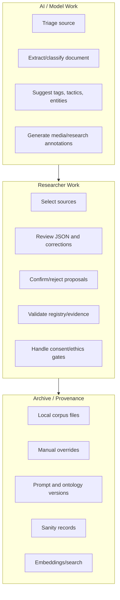
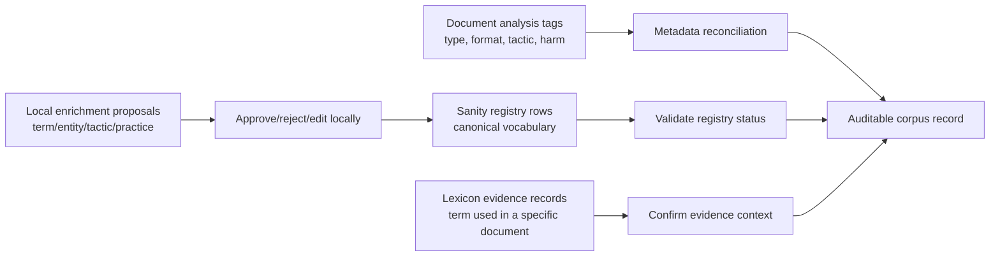

# Human-AI Collaboration Schematic Prompt

Use this document as a prompt for Claude to create a presentation-ready schematic of the SurvivingSOGICE ingesting tool as a Human-AI research collaboration process.

## Goal

Create a clear visual schematic that explains how the ingesting tool supports a researcher-led archive workflow. The diagram should show that AI does not replace researcher judgement: it proposes, classifies, routes, extracts, and flags; the human researcher reviews, corrects, validates, rejects, and decides what becomes part of the corpus and public-facing knowledge base.

## Audience

The audience is academic/research-facing: digital humanities, gender studies, archival science, AI-assisted research, and SOGICE/conversion-practices scholarship. They do not need to know the implementation details, but they should understand the methodological contribution.

## Core Message

The system is a layered Human-AI collaboration pipeline:

1. The researcher collects possible sources.
2. A source queue organizes and triages them before ingestion.
3. AI models extract text, classify documents, propose tags, identify actors, suggest lexicon entries, and generate research annotations.
4. The researcher reviews and corrects every consequential layer.
5. Validated outputs are stored locally and then selectively pushed to Sanity/Supabase for structured archive use.
6. The system preserves audit trails, uncertainty, and provenance rather than treating model output as truth.

## Key Concepts To Show

- **Pre-ingestion source queue**: Zotero/Notion/browser links enter a waiting room before becoming corpus documents.
- **Triage**: a quick model estimates priority, source type, document type, and recommended model route.
- **Ingestion pipeline**: intake, extraction, preprocessing, analysis, local save, optional upload.
- **Analysis tags**: document-level classifications such as type, format, country, tactics, harm, evidence, rhetorical intensity.
- **Enrichment proposals**: model-suggested lexicon terms, entities, tactics, practices, and claims.
- **Researcher review gates**: checkpoints where the human can edit, confirm, reject, or stop.
- **Sanity registry validation**: canonical registry rows are validated separately from local model proposals.
- **Lexicon evidence confirmation**: per-document evidence records are confirmed separately from the term itself.
- **Media review**: transcript versions, annotations, comments, related sources, and media-specific research profiles.
- **Storage layer**: local corpus files, Sanity structured archive, Supabase semantic search embeddings.
- **Auditability**: prompt version, ontology version, source metadata, triage model used, manual overrides, consent warnings.

## Suggested Diagram 1 — Full Workflow

Create a left-to-right or top-to-bottom flow with human and AI lanes.

```mermaid
flowchart LR
  A["Researcher collects URLs<br/>(Zotero, Notion, browser, PDFs, videos)"]
  B["Source Queue<br/>dedupe, batch, notes, status"]
  C["Fast AI triage<br/>priority, type, model route, reason"]
  D["Researcher decision<br/>ready, skip, defer"]
  E["Ingestion pipeline<br/>intake, extraction, preprocess"]
  F["Primary AI analysis<br/>classification + structured JSON"]
  G["Researcher checkpoint<br/>review/correct analysis"]
  H["Local corpus archive<br/>analysis.json, metadata, evidence"]
  I["Enrichment AI<br/>lexicon/entity/tactic/practice proposals"]
  J["Researcher proposal review<br/>approve, reject, edit"]
  K["Sanity registries<br/>validated canonical terms/entities/tactics"]
  L["Supabase embeddings<br/>semantic search"]

  A --> B --> C --> D --> E --> F --> G --> H
  H --> I --> J --> K
  H --> L
```

## Suggested Diagram 2 — Human-AI Responsibility Split

Show three bands: AI proposes, human decides, archive records provenance.

## Suggested Diagram 3 — Review Layers

This diagram should explain why there are multiple review states.

## Visual Style

Use a clean academic/technical schematic style:

- Avoid marketing-style hero graphics.
- Use muted colors and clear labels.
- Prefer swimlanes or layered boxes.
- Use researcher actions in one color, AI/model actions in another, archive/storage in a third.
- Make review gates visually prominent.
- Use short labels and captions.
- Include the phrase: **"AI proposes; researcher validates; archive preserves provenance."**

## Specific Screenshot Panels To Use If Available

Use screenshots from `docs/screenshots/human_ai_workflow/` if present:

- Dashboard or overview
- Source Queue
- Ingest Workbench
- Document List with analysis/enrichment tags
- Lexicon / Sanity Registry Status
- Media Review

## Output Requested From Claude

Please produce:

1. A one-page schematic for slides.
2. A more detailed architecture diagram for methods discussion.
3. A short explanatory caption, 150-250 words.
4. A list of 5-7 talking points for a preliminary presentation.
5. A Mermaid version of the diagram for version-controlled documentation.

## Draft Caption To Refine

The SurvivingSOGICE ingesting tool operates as a Human-AI collaboration pipeline for building a research archive of SOGICE-related documents and media. Its architecture can be described as role-specialized staged intelligence: bounded AI roles handle routing, classification, enrichment, and consistency support, while the researcher remains the methodological authority. Sources first enter a queue where they can be deduplicated, batched, and triaged before ingestion. AI models then assist with extraction, routing, document classification, tag proposal, lexicon discovery, entity identification, and media annotation. At each consequential stage, the researcher remains the decision-maker: reviewing structured JSON, correcting metadata, confirming consent-sensitive material, validating registry entries, and deciding which outputs are uploaded to the archive. The system distinguishes between model suggestions, local researcher approval, canonical registry validation, and per-document evidence confirmation. This layered design makes uncertainty visible and preserves provenance through local files, prompt and ontology versioning, audit sidecars, manual override markers, Sanity records, and Supabase embeddings. The methodological principle is simple: AI proposes; researcher validates; the archive preserves provenance.
