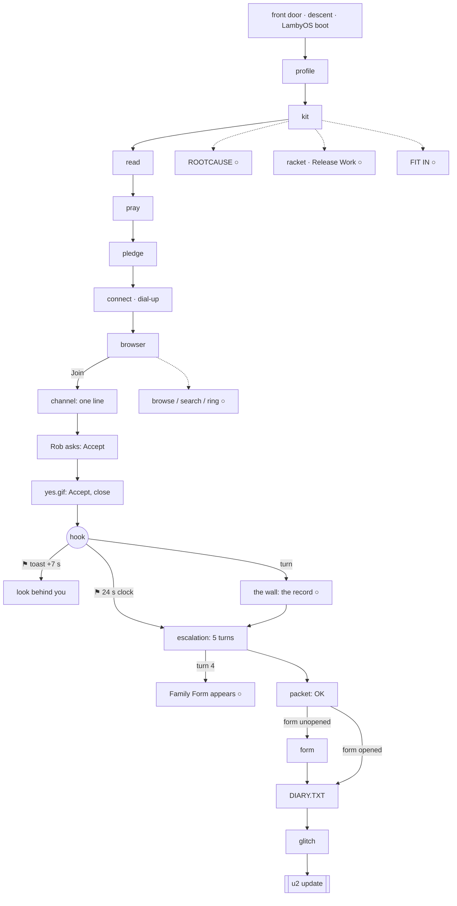
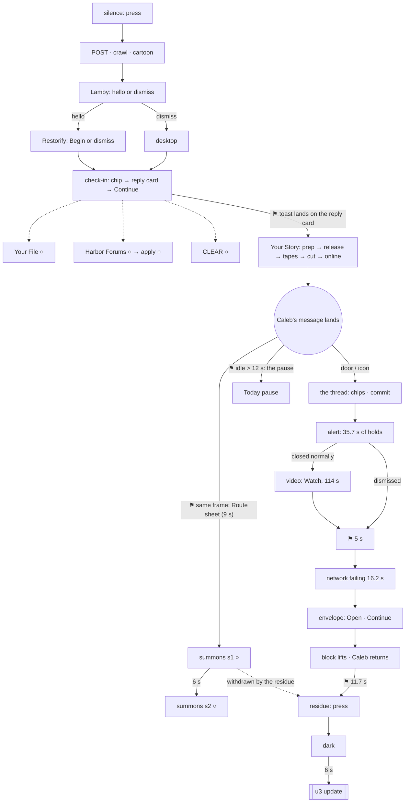
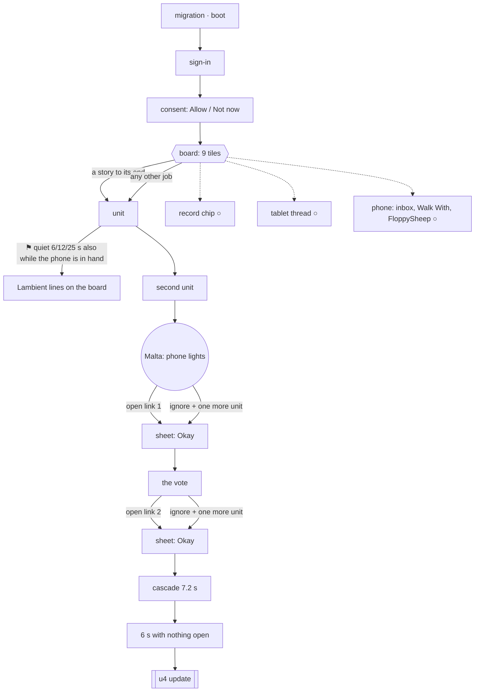
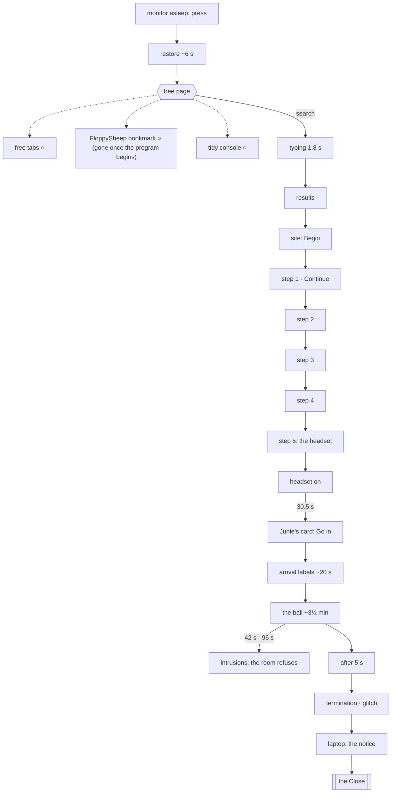
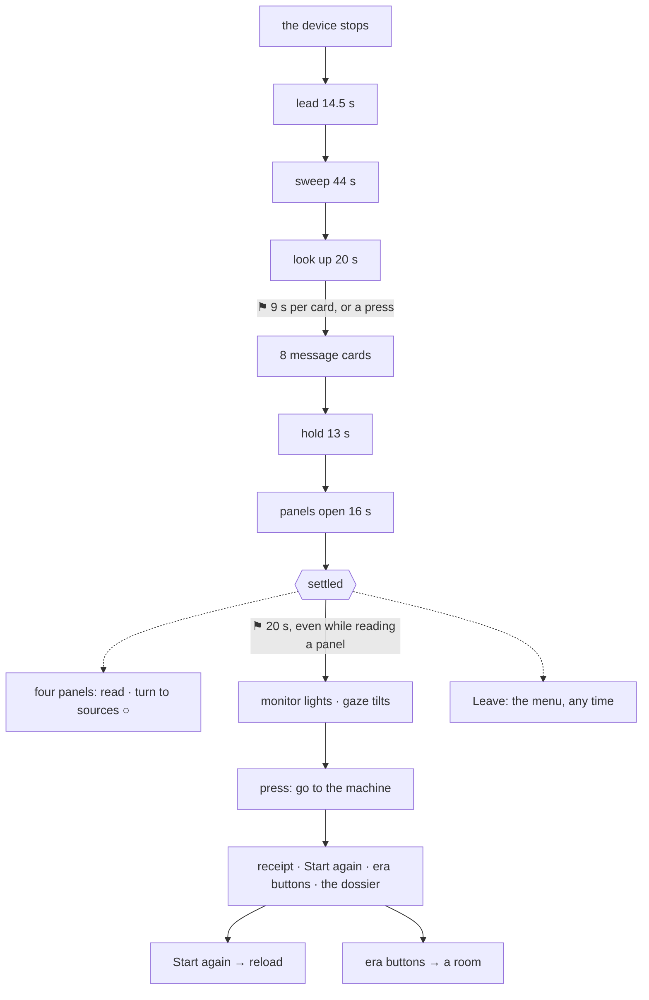

STATUS: draft

# Cadence, not clock — the study (2026-10-10)

*His direction (2026-10-10): "We should try and not use time-based sequences, and make them cadence-wise, so to study
the multiple pathways to achieve the resolution." W1-B3 (cadence), §D (2003), W1-C8 (the flip), W1-E5 (the link
cadence), W1-F4 (the Commons' steps). A study only: no code or data changed. Read at `4e6bd0c` on `reinterp`.*

**How to read it.** Every clock is given a verdict:
- **KEEP**: the fiction's own time, which should stay. Examples: a song's length, a dial-up, a typing animation, a
  boot, the ball's stillness ("stillness is not a dead end").
- **CADENCE**: it should wait for a player event instead, and the row names which event.
- **IDLE**: it should wait for the player to be quiet, and the row says for how long.

Each CADENCE or IDLE row gives the smallest change, with file and function names. "Busy?" asks whether the clock can
land while the player is doing something else: a video playing, a conversation open, a game in hand, a window being
read, the player turned away.

**Builds on** `docs/reinterp/CADENCE_2003_2026-10-09.md`. That doc is on PR #3's branch (`cloud/cadence-2003`); at
`4e6bd0c` its six waits (C1–C4, C6, C7) are **not yet in `reinterp`**. Where this study repeats one of them it says
"PR #3 C*n*".

---

## 0 · What the sweep found, in short

- **Scope.** 11 `setTimeout`/`setInterval` calls in `src/` (5 of them debug-only), 135 timing constants, 75 inline
  time comparisons, and about 160 timing values in `data/`. Most are KEEP: the machine booting, a song, a typing
  speed, a camera move, a fade. About **20 live clocks** decide *when the story moves on*, and those are the ones
  this study is about.
- **The piece is mostly cadence already.** Since S145, the 2016 summons, S150's Continue-only steps in 2026, S207's
  pauses and S219's waits, most beats wait for a press, a ledger record or a quiet stretch. The remaining clocks
  cluster in five places:
  1. **1997, after the hook.** Rob's escalation fires on a **24 s clock** if the player has not turned. A "look
     behind you" toast fires **7 s after the hook**, while Rob's last line and the picture are still being read
     (W1-C8: "more time after the ask to flip, because the narrative is still playing").
  2. **2003, the Caleb collapse.** The alert's **35.7 s of timed holds**, the mail's **5 s** clock, and the
     **11.7 s** after "i'm coming to you" (W1-D18, D19). The summons on a 9 s / 6 s clock (W1-D16) is fixed on
     PR #3.
  3. **2016, the workstation's quiet counter.** It does not know the phone is in her hand, so Lambient can speak
     on the workstation while she reads Bea's thread or plays FloppySheep. The live comment thread on the tablet
     drops a comment on a **46 s clock**.
  4. **Every update's "Remind me later".** It comes back on a **40 s clock**, whatever she is doing.
  5. **The Close.** Its eight message cards advance every **9 s** (up to 39 words each, about 260 words a minute).
     Twenty seconds after the panels open, the gaze is conducted down to the monitor, even if she is reading a
     panel.
- **Overlaps found:** 11 places where a clock plays a beat on top of another, or moves on while she is reading (⚑ in
  §1–§5; 2003's five are fixed on PR #3), plus the 2026 intrusions, which overlap by design. **Unreachable beats:** 2,
  both optional: 2003's summonses for a prompt player (§2), and 2026's FloppySheep bookmark (§4).
- **The walker was not run.** Its numbers would not change the reading; the clocks are read from the code.

---

## 1 · 1997 (Daniel)

### 1a · The clocks

| # | Clock (file · name · value) | What it starts | Player is likely | Busy? | Verdict | Smallest change |
|---|---|---|---|---|---|---|
| 1.1 | `orientingCard.ts` `ARM_DELAY_MS` 4 s | the enter buttons arm | reading the content note | — | **KEEP** (ethics: "enter can never be instant") | — |
| 1.2 | `app.ts` `DESCENT_SECONDS` 12 s, wake 1.2 + 1.8 s | the descent into the room, the light | watching (conducted) | — | **KEEP** | — |
| 1.3 | `os.ts` `BOOT_CPS` 0.030 s/char, `R_BOOT_HOLD` 3.2, `R_SPLASH_SECONDS` 4.2 | the LambyOS crawl → splash → profile | reading; any press skips the crawl and the splash | no | **KEEP** (skippable already) | — |
| 1.4 | `kit.ts` `AUTORUN_SECONDS` 2.6 | the disk autoruns the wizard | the disk just pressed | no | **KEEP** | — |
| 1.5 | `kit.ts` `DIAL_SECONDS` 8.0, `DIAL_LINE_EVERY` 1.9 | the dial-up → the browser | listening to the modem | no | **KEEP** (the 7.4 s recording is the beat) | — |
| 1.6 | `tapes.ts` `TAIL_SECONDS` 3; the prayer's length (`s1_prayer`) | the tape's end, Amen | listening; Amen offered from the first chorus | no | **KEEP** (and already pressable early) | — |
| 1.7 | `guide.ts` `prayStep` `idleSeconds > 20`; `browsingIdle` > 25; `channelWaiting` > 20 | the guide's side line | stalled | no | **IDLE** ✓ already (resets on every press) | — |
| 1.8 | `irc.ts` `AMBIENT_START` 1.4, `HOLD_CHANNEL` 1.5, `CPS_CHANNEL` 22 | the room's lines type | reading the channel | no | **KEEP** (a room talking) | — |
| 1.9 | `irc.ts` `DM_AFTER_AMBIENT` 2.6 after the room settles **and** he has spoken | Rob's request | just pressed his one line | no | **KEEP** ✓ cadence already | — |
| 1.10 | `irc.ts` `HOLD_DM` 2.6, `CPS_DM` 19 | Rob types | reading | no | **KEEP** | — |
| 1.11 | `os.ts` `behindToastAt = t + 7` (on `onHooked`) | the toast "look behind you" | **reading Rob's last line, or the picture he just sent** | **yes** ⚑ | **IDLE** | `DesktopOS.update`: fire the behind-toast only when `this.idleSeconds > 6 && !this.yesOpen && this.irc?.dmIdle` (a small getter on `IrcApp` for "the DM stream is idle"). |
| 1.12 | `os.ts` `ESCALATION_FALLBACK` 24 s after the hook | Rob's residential pitch starts in the DM, even if the player never turned | **turning slowly, reading the wall, or reading Rob's last line**; if the IRC window is minimised, it types out of sight | **yes** ⚑ (W1-C8) | **IDLE** | `DesktopOS.update`: advance the fallback clock only while the player is quiet (`idleSeconds > 4`), the IRC window is open and on top, and the camera faces the desk. Simplest form: replace the `t >= escalationFallbackAt` test with an accumulator `fallbackT += dt` counted only under those conditions, firing at 24 s. |
| 1.13 | `irc.ts` `escEndAt = t + 2.4` after the last reply | the packet | just answered | no | **KEEP** (a beat after his press) | — |
| 1.14 | `os.ts` `diaryPendingAt = t + 1.0` after the packet's OK (or after the form closes) | DIARY.TXT opens itself | just pressed OK | no | **KEEP** (chained to the press) | — |
| 1.15 | `diary.ts` `TYPE_CPS` 13, `READ_HOLD` 4.5, `FLAG_WAIT` 2.2, `DELETE_SECONDS` 5.5, `BREAKOUT_HOLD` 3 | the writing, the flag, the erase, the tug-of-war | watching, then pressing to keep the truth | no | **KEEP** (the tug-of-war needs presses; the rest is the system acting) | — |
| 1.16 | `spine.ts` `T1_DELAY` 1.2 after `diary-glitch` | the u2 notice | watching the glitch | no | **KEEP** | — |
| 1.17 | `os.ts` pause: `went-online && idleSeconds > 16`; Word of the Day: `idleSeconds ≥ 15` | the "Did you know?", the word | stalled | no (never over the channel, S208) | **IDLE** ✓ | — |
| 1.18 | `screensaver.ts` `SAVER_SECONDS` 150 | the starfield / WALK ON | stalled | no | **IDLE** ✓ | — |
| 1.19 | `os.ts` `GUIDE_TIP_SECONDS` 7 | a new guide line folds into its well | — | no | **KEEP** (cosmetic; the line stays) | — |
| 1.20 | u2: `updates.json` `cascade.everyMs` 420 | the error windows pile | watching | no | **KEEP** | — |
| 1.21 | `update.ts` `REMIND_SECONDS` 40 | "Remind me later" returns | **anything: a game, the wall, the racket** | **yes** ⚑ | **IDLE** (all four updates; see §6) | — |

### 1b · The pathways (arrival → u2)

| Spine beat (map `e1`) | Waits for | Optional beside it |
|---|---|---|
| profile | press (three chips, picture, goal) | — |
| kit | the A: icon or the disk on the desk | — |
| read → pray → pledge → connect | a press each (Amen can come early) | from kit on: ROOTCAUSE ○, the racket / Release Work ○, FIT IN on the handheld ○ |
| web → channel | Join, then his one line | browse / search / the ring ○ |
| request → image → (hook) | Accept, Accept, close the viewer | — |
| *(the flip)* | the turn (`wallSeen` ○) **or the 24 s fallback** | the wall: the record ○ |
| dm (escalation, 5 turns) | one reply each | at turn 4 the Family Form exists ○→ |
| packet | OK | — |
| form (if it exists and was never opened) | open it (finished or abandoned) | — |
| diary | the tug-of-war presses | — |
| update (u2) | the notice | "Remind me later" once |

**Orders a player can take.** The four optional strands (ROOTCAUSE, the racket, FIT IN, browsing) open any time
after the disk, as long as the desktop is otherwise bare. The flip can come before the escalation (the earned path)
or never (the fallback). The Family Form can be opened at turn 4, after the packet, or not at all; the diary waits
for it if it exists.

**⚑ Overlaps.**
- **1.11:** the behind-toast lands on Rob's last line or the picture.
- **1.12:** the fallback escalation types into the DM while the player is turned or reading. If the IRC window is
  minimised, Rob's pitch types where no one sees it; the map's hint recovers it.

**Unreachable:** none. Every optional strand stays reachable until the update.

---

## 2 · 2003 (Daniel, Caleb)

The full beat-by-beat timeline is in `CADENCE_2003_2026-10-09.md` (PR #3). Here: the clocks and the verdicts.

### 2a · The clocks

| # | Clock | What it starts | Player is likely | Busy? | Verdict | Smallest change |
|---|---|---|---|---|---|---|
| 2.1 | `os.ts` `E2_POST_SECONDS` 2.0, crawl, `E2_BOOT_HOLD` 2.2, `LAMBY_BOOT_HOLD` 2.4 | the arrival | watching | no | **KEEP** | — |
| 2.2 | `lambyCartoon.ts` `E2_CARTOON.handoff` 23.66 s + the jingle | Lamby's introduction | watching (not skippable, his ruling) | no | **KEEP** | — |
| 2.3 | `os.ts` `PROGRAM_SPLASH_SECONDS` 1.6 | every 2003 program's loading box | presses swallowed for 1.6 s | no | **KEEP** (the period) | — |
| 2.4 | toast lifetimes: the testimony offer 9 s, forum 6 s, "while you wait" 8 s, way-back 7 s | a corner line disappears | maybe reading elsewhere | the line can expire unseen | **KEEP** (the icon and the helper carry it) — question 7 | — |
| 2.5 | the testimony offer's toast, at the chip press | lands on Lamby's reply card | **reading the reply** | **yes** ⚑ | **CADENCE**: the card's Continue | PR #3 C4 |
| 2.6 | `os.ts` pause `idleSeconds > 12`, Word of the Day ≥ 15, "while you wait" > 30, `SAVER_SECONDS` 150 | the ambient one-offs | stalled | no (need `desktopIdle()`) | **IDLE** ✓ | the pause also over Caleb's door: PR #3 C7 |
| 2.7 | testimony clips (36 / 20 / 12 / 8 s), preview 1.9 s × blocks, export 4 s, buffer 4.5 s | his story plays | watching | — | **KEEP** (playback, by press) | — |
| 2.8 | `helper.ts` `idleSeconds` 20 × 1.8 | the frame's hint | **watching a clip, the video, the alert** | **yes** ⚑ (W1-D7) | **IDLE** + not while the fiction plays | PR #3 C1, which should go to every era (§6) |
| 2.9 | `spine.ts` `SEND_DELAY` 9 / `SEND_GAP` 6 | the Route sheet, the Referral | **in the frame Caleb's message lands; or in any window** | **yes** ⚑ (W1-D16) | **CADENCE**: a bare desktop | PR #3 C2 + C6 |
| 2.10 | `s2_caleb.json` `pacing.chat` (13 cps, gaps 1.4 / 1.6 / 0.9 s) | Caleb types | reading; **waits at every chip** | no | **KEEP** (the model cadence) | — |
| 2.11 | `commitLandsSeconds` 2.2 | the alert | just pressed | no | **KEEP** | — |
| 2.12 | `pacing.alert` holds: stop 6.5, block 3.2, wanting 7.5, streak 4.5, system 8.5, sad 5.5 (35.7 s) | Lamby's alert walks itself | reading, or not | it moves on whether or not she has read the line | **CADENCE** (his call: question 3) | `AccountabilityApp.update`: per step, advance at `max(hold, the next press on the band)`; the hold becomes a floor, a press a "next". Adds a press, so it is his. |
| 2.13 | `os.ts` `PUREMAIL_DELAY` 5.0 after the video closes or the alert is dismissed | the network failing → the mail | **the 5 s in which Caleb's break toast can be answered**; or mid-redaction | **yes** ⚑ (W1-D13) | **IDLE** after the redaction (PR #3 C3); then **CADENCE** after the toast is pressed **or** 12 s quiet | `DesktopOS.update` `pureMailAt` check: `&& (this.calebToastPressed \|\| this.idleSeconds > 12)` (PR #3 proposal P3) |
| 2.14 | `s2_caleb.json` `network` 4 × (2 + 1.3) + 3 = 16.2 s; `mail.arriveGlitchSeconds` 2.8 | the system tries and fails, then the envelope | watching | no | **KEEP** (the apparatus's own failure, shown) | — |
| 2.15 | the redaction 0.52 s/row (both ways) | the chat walked out / back | watching | no | **KEEP** | — |
| 2.16 | `pacing.return` lead-in 3.4, line gap 2.8 (4 lines) | Caleb returns | reading him | no | **KEEP** (a person typing) | — |
| 2.17 | `pacing.return.settleSeconds` 4.5 + `residue.dissolveSeconds` 4.2 + `arriveSeconds` 3 = **11.7 s** | the dissolve → bare dark → the residue line | **sitting with "i'm coming to you." with nothing to press** | not busy, but it reads as a dead stretch ⚑ (W1-D19) | **CADENCE** (his call: question 4) | `CalebThreadApp.update`: start the dissolve at `max(1.5 s, a press anywhere on the chat)`, with `settleSeconds` as the idle fallback. Or data only: settle 4.5 → 2.0, arrive 3 → 1.5. |
| 2.18 | `residue.holdSeconds` 6.5 after the press | the thread ends | — | no | **KEEP** | — |
| 2.19 | `spine.ts` `RESIDUE_GAP` 6 | the u3 notice | on a dark screen | no | **KEEP** (the documented failure, not the player's) | — |
| 2.20 | `netvision.ts` the video (114 s), skip from 34 s, `STATIC_HOLD_SECONDS` 2.6 | Lamby's ad | watching | — | **KEEP** | — |
| 2.21 | `update.ts` `REMIND_SECONDS` 40, install 13.5 s | u3 | — | as 1.21 | **IDLE** (§6) | — |

### 2b · The pathways (arrival → u3)

| Spine beat (map `e2`) | Waits for | Optional beside it |
|---|---|---|
| assistant | press (hello / dismiss) | — |
| check-in | a chip, then Continue | — |
| your story: prep → release → tapes → cut → online | a press each; the tapes must be watched to their end | Your File ○, Harbor Forums ○ → apply ○, CLEAR on the phone ○, the 1997 files ○ |
| *(a summons)* | the spine: 9 s and `testimony-online` (PR #3: and a bare desktop) | Route sheet ○ → Referral ○ (6 s after) |
| a message from outside | open it (the door-toast or the Messenger icon) | — |
| the thread (`quiet`) | chips; the commit | the song ○ |
| the intervention | the alert's 35.7 s (or dismiss) → [video: Watch] → 5 s → the network failing → Open → Continue | — |
| what is left (`quiet`) | the residue press | — |
| update (u3) | the notice | "Remind me later" once |

**Orders.** The optional strands (Your File, Harbor, CLEAR, the 1997 files) can be taken before, between or after the
story's stages, and before Caleb. The summonses (today) arrive with the message. A player who opens the message at
once never answers them, and the residue withdraws them unanswered.

**⚑ Overlaps.**
- **2.5:** the testimony toast lands on the reply card.
- **2.9:** the Route sheet and Caleb's message land in the same frame.
- **the pause:** it can open over Caleb's door.
- **2.13:** the mail can start mid-redaction.
- **2.8:** the helper speaks over the clips and the video.

All but 2.13's reading A are fixed on PR #3. **Unreachable:** the summonses, in practice, for anyone who opens
Caleb's message promptly. They are optional.

---

## 3 · 2016 (Vera)

### 3a · The clocks

| # | Clock | What it starts | Player is likely | Busy? | Verdict | Smallest change |
|---|---|---|---|---|---|---|
| 3.1 | `graceQueueLite.ts` `DARK_SECONDS` 1.6, `BOOT_LINE_SECONDS` 1.1, `BOOT_TAIL` 1.8, `INSTALL_LINE` 1.0, `INSTALL_TAIL` 2.6 | the migration and the boot | watching | no | **KEEP** | — |
| 3.2 | `graceQueueLite` `boardQuietT > 6` (after the first job) | the "This week" card | on the board, quiet — **or holding the phone** | **yes** ⚑ | **IDLE**, phone-aware | `GraceQueueLite.update`: count `boardQuietT` only while the phone is not in her hand. `era3Devices.tick` sets `graceQueueLite.phoneInHand = phoneHeld` before `graceQueueLite.update(dt)`; the counter adds `dt` only when it is false (and resets to 0 when she picks the phone up). |
| 3.3 | `boardQuietT > 12` | the Word of the Day (Lambient's lane) | same | **yes** ⚑ | **IDLE**, phone-aware | same change |
| 3.4 | `boardQuietT > 25` and the group / tag job unfinished | Lambient's two "waiting" lines | same: **Bea's thread can be on the phone in her hand** (felt: "no Lambient lane on any screen showing a person's words") | **yes** ⚑ | **IDLE**, phone-aware | same change |
| 3.5 | `JOB_RETURN_SECONDS` 2.0 | a finished job returns to the board | reading its last state | no | **KEEP** (W1-E3) | — |
| 3.6 | Noa's video (`NOA_SECONDS` 24), the audiogram (`storyCut.ts` `TOTAL_SECONDS` 96, 40 s window), the podcast's clips | playback | watching, by press | — | **KEEP** | — |
| 3.7 | `s3_comments.json` `schedule`: `afterOpen` 7 s and **46 s**; `afterReplies` n + `delay` 3.5–5 s | the tablet's live thread: a new comment | **reading or answering the previous one** | **yes** ⚑ (the 46 s one) | **CADENCE**: after the previous reply | data only: turn `schedule[4]` (`afterOpen: 46`, comment `c8`) into `afterReplies: 3, delay: 4`, or keep `afterOpen` and add an `idle` condition in `CommentsApp.update`. The `afterReplies` entries are already cadence. |
| 3.8 | the Malta arm: `workDone() ≥ 2` | the phone lights | finishing a job | no | **KEEP** ✓ cadence | — |
| 3.9 | "capture either way": `onWorkDone` | the "ignored" sheet | finishing another job | no | **KEEP** ✓ cadence | — |
| 3.10 | `LIFT_DELAY_SECONDS` 1.4, `LIFT_SECONDS` 5, `cluster.ts` `E3_LIFT_SECONDS` 5 | the room brightens | reading the sheet | no | **KEEP** (felt before understood) | — |
| 3.11 | `phoneE3.ts` `CASCADE_STEP` 0.45 × 16 = 7.2 s | the cascade | watching | no | **KEEP** (other people's volume); Vera plan M3 could shorten it | — |
| 3.12 | `era3Devices.ts` `FINAL_GAP` 6 s, counted only while nothing is open | u4 arms | nothing open | no | **KEEP** ✓ cadence + idle | — |
| 3.13 | screensaver (lock screen) `SAVER_SECONDS` 150 | the lock | stalled | no | **IDLE** ✓ | — |
| 3.14 | `update.ts` `REMIND_SECONDS` 40; u4 install 13.5 s | u4 | — | as 1.21 | **IDLE** (§6) | — |

### 3b · The pathways (arrival → u4)

| Spine beat (map `e3`) | Waits for | Optional beside it |
|---|---|---|
| migrate | the boot (clock) | — |
| sign-in | press | — |
| consent | Allow / Not now | — |
| work | two units: two stories, or a story and a job, or two jobs | the 9 tiles in any order ○; the record chip ○; the tablet's comments thread ○; the phone's home, inbox, Walk With, FloppySheep ○ |
| phone | unlock → the notification | — |
| vote | open link 1 (or finish another unit) → Okay → link 2 (or another unit) → Okay | — |
| cascade (`quiet`) | the 7.2 s of messages | — |
| update (u4) | 6 s clear (nothing open, phone down) | "Remind me later" once |

**Orders.** Any two units arm the phone. A player can do all nine jobs first, or none beyond the two. The two links
can be opened or ignored, independently (four routes, the same end). The phone's home, inbox and FloppySheep can be
used from the start.

**⚑ Overlaps.**
- **3.2–3.4:** Lambient's board lines, while she holds the phone (FloppySheep in hand, Bea's thread open).
- **3.7:** the tablet comment that arrives on a 46 s clock while she is answering another.

**Unreachable:** none today. With Vera's three-option plan (PR #4, not built), §4c of that doc lists what to
re-point.

---

## 4 · 2026 (Maya)

### 4a · The clocks

| # | Clock | What it starts | Player is likely | Busy? | Verdict | Smallest change |
|---|---|---|---|---|---|---|
| 4.1 | `browser.ts` `BOOT_SECONDS` 2.6 + `RESTORE_SECONDS` 2.4 + tabs × `TAB_GAP` 0.22 ≈ 6 s | the session restores itself | watching (not skippable) | no | **KEEP** | — |
| 4.2 | `browser.ts` `freeQuietT > 10` (resets on press) | L's "what else is open" line; the phrase of the day | stalled on the restored page | no | **IDLE** ✓ | — |
| 4.3 | `s4_browser.json` `program.typingSeconds` 1.8 (+0.6) | the search finishes her sentence | just pressed | no | **KEEP** (the autocomplete is the beat) | — |
| 4.4 | the agent's greeting, a bubble per 0.9 s | Second Thoughts says hello | reading | no | **KEEP** | — |
| 4.5 | `ADVANCE_SECONDS` 1.4 (the last step only); every other step waits for Continue | the program's steps | pressing | no | **KEEP** ✓ cadence (S150) | — |
| 4.6 | `files.restoringSeconds` 3.2 | the photograph is "restored" | watching | no | **KEEP** | — |
| 4.7 | `browser.ts` `quietT > 25` (resets on press) | L's "while you wait": the console game | stalled | no | **IDLE** ✓ | — |
| 4.8 | `space.ts` session: breath at `session.seconds` 9, the recording at 17, **Junie's card at `sessionSeconds` 30.5** | the session that never begins, then the invitation | in the headset; nothing to press; the turn does nothing | no (nothing else exists) | **KEEP**, or **IDLE** if he wants the card to follow a look (question 8) | if IDLE: `E4Shell.update`, count `sessionT` only while the camera is still; the card waits for a held look. |
| 4.9 | `ball.ts` `WORLD_IN_SECONDS` 2.4, the arrival labels (4.6 + 4.4 + 4.8 + 6 s), `OFF_SECONDS` 2.6 | the hall arrives, the device drops | watching | no | **KEEP** | — |
| 4.10 | the ball's line holds (greeting 7.8 s; opening + four categories + closing ≈ 3½ min) | the MC, the room | watching, turning, moving between markers | — | **KEEP** (his: "stillness is not a dead end") | — |
| 4.11 | `s4_ball.json` `system.intrusions` at ballT 42 s (8 s) and 96 s (14 s, `needsHer`) | the apparatus tries to reconnect; the room refuses | watching a category | it lands on a line (by design) | **KEEP** (the refusal is the room's) — question 9 for W1-F4 | — |
| 4.12 | `system.terminateSeconds` 5; `space.ts` `GLITCH_SECONDS` 3.2; the browser's failure | the termination, the glitch | watching | no | **KEEP** | — |
| 4.13 | `spine.ts` `E4_HOLD` 22 | (held by `e4HoldsTheSpine` until the ball hands off) | — | — | **dormant** | — |

### 4b · The pathways (arrival → the Close)

| Spine beat (map `e4`) | Waits for | Optional beside it |
|---|---|---|
| wake | press the sleeping monitor | — |
| l | the restore (clock) | the free tabs (record, photos, care, extra, chat) ○; FloppySheep bookmark ○ (**gone once the program begins**); the tidy console ○ |
| search | press; the typing; the results | — |
| site | open the first result, Begin | — |
| steps 1–5 | L asks; a chip; the step's press; Continue | the console ○ |
| headset | press it on the desk | — |
| session (`quiet`) | 30.5 s, then Junie's card: Go in | — |
| commons (`quiet`) | the ball (≈3½ min; two intrusions) | the floor markers ○ (moving in the crowd) |
| close (`quiet`) | the termination, the glitch, the laptop's notice | — |

**Orders.** The free tabs and the console can be visited before the search. Once the program begins, the tabs
become its steps: their content is still reached, in order. In the Commons she can stand anywhere or move between
the markers; the ball runs either way.

**⚑ Overlaps.** 4.11's intrusions land over the ball's lines, deliberately. **Unreachable:** the FloppySheep
bookmark, for a player who searches first. It is optional and files nothing.

---

## 5 · The Close

### 5a · The clocks (`src/engine/app.ts`, the Close's stages)

| # | Clock | What it starts | Player is likely | Busy? | Verdict | Smallest change |
|---|---|---|---|---|---|---|
| 5.1 | `CLOSE_LEAD_SECONDS` 14.5 | the dead screens hold | watching | no | **KEEP** | — |
| 5.2 | `CLOSE_SWEEP_SECONDS` 44 (210° conducted), `CLOSE_LOOKUP_SECONDS` 20 | the travel and the look up | carried | no | **KEEP** (scripted sends are allowed; question 10) | — |
| 5.3 | `CLOSE_CARD_SECONDS` 9 per card, 8 cards (9–39 words) | the Close's message | **reading: 39 words in 9 s is about 260 words a minute, for readers whose second language is English** | **yes** ⚑ | **CADENCE**: a press | `app.ts`, the `closeStage === 'message'` branch: advance only on press (it already does), and keep the clock only as a long idle fallback, e.g. `CLOSE_CARD_SECONDS` 9 → 30 and reset `closeHoldT` on any pointer movement. |
| 5.4 | `CLOSE_HOLD_SECONDS` 13, `CLOSE_LIGHTS_SECONDS` 8, `CLOSE_OPEN_SECONDS` 16 | night, the score, the panels open | watching | no | **KEEP** | — |
| 5.5 | `CLOSE_MONITOR_AFTER_SECONDS` 20 after the panels open; `CLOSE_MONITOR_TILT_SECONDS` 8 | the monitor lights and **the gaze is conducted down to it** | **reading a panel, or turning it to its sources** | **yes** ⚑ | **IDLE**: only once no panel is under her gaze | `app.ts`, the `settled` branch: add `if (closeStage === 'settled' && cloud.panelAt(gaze) !== null) closeHoldT = 0;` (the same `panelAt` test the frame already makes for `gazeOnPanel`). |
| 5.6 | `CLOSE_GO_SECONDS` 8 | the eye goes to the machine | pressed the glass | no | **KEEP** ✓ cadence | — |
| 5.7 | `closeMonitor.ts` `RISE_SECONDS` 3 | the receipt prints | watching | no | **KEEP** | — |
| 5.8 | `app.ts` the XR restart's 3.2 s reload | the plate's note is read | in a headset | no | **KEEP** | — |

### 5b · The pathways

**⚑ Overlaps.** 5.3 (cards on a clock) and 5.5 (the gaze is conducted off a panel being read). **Unreachable:**
none. The panels stay pressable after the monitor lights.

---

## 6 · Across the piece (the frame and the updates)

| # | Clock | Verdict | Smallest change |
|---|---|---|---|
| 6.1 | `helper.ts` `idleSeconds` 20, × 1.8 on a mouse | **IDLE** ✓, plus silence while the fiction plays: PR #3 C1 covers 2003. **Extend `os.fictionPlaying` to 1997** (the tapes playing: `os.tapeProbe().playing`; the diary's erase), **2016** (Noa's video, the audiogram, the cascade; the phone in hand) and **2026** (`browser` typing / restoring, the ball). | `DesktopOS.fictionPlaying` (os.ts) gains the 1997 terms; `era3Devices` exposes a `playing` for 2016 to `app.ts`; `E4Shell` a `playing` for the ball. |
| 6.2 | `update.ts` `REMIND_SECONDS` 40: "Remind me later" returns (u2, u3, u4) | **IDLE**: the law is "works once", not "40 seconds" | `UpdateApp.update`: in phase `reminded`, add `dt` to `t` only while the OS reports nothing open and the player quiet. Pass `os.desktopIdleForProps() && os.idleSeconds > 5` in (or let the OS tick the ritual with a `quiet` flag). The notice then returns on the first quiet moment after 40 s. |
| 6.3 | toast lifetimes (5–14 s) | **KEEP** (the icons, the map and the helper hold the same news), but question 7 | — |
| 6.4 | `app.ts` `HINT_SECONDS` 7 (the move hint), `PRACTICE_SECONDS` 6, captions `holdSeconds` 1.8, cues | **KEEP** (the frame teaches once; captions follow sound) | — |
| 6.5 | `app.ts` `FLIP_SECONDS` 0.9, blink 0.13 + 0.22 s, `heldDevice.ts` 0.45 s | **KEEP** (movement) | — |
| 6.6 | `room/fluid_niche.json` `gaze.dwellMs` 2500 (`app.ts`, the niche dwell) | **a look that files.** After 2.5 s of gaze on a hero/set station, the niche changes facet and the ledger files `niche:dwell:<facet>` ("Ethics #10 — the player's own act"). It moves no camera, so R28's movement law holds, but it is the one place a *look* writes the record. Question 12. | none until he rules |

**Dormant, not live** (kept out of the verdicts):
- `offers.ts` `BEAT_SECONDS` (the offers no longer open since 2026-09-12);
- `s4_l.json` unit holds (L's ten units, retired S130);
- `s4_offers.json` line holds;
- `spine.ts` `UPDATE_GAP` / `E4_HOLD`;
- `s2_media.json` `skipDelaySeconds` 5 (superseded by s2_caleb's 34);
- `comments.ts`'s live thread is **live** on the tablet, not dormant (3.7).

---

## 7 · The first batch: ten changes, ranked

Ranked by how directly they answer his notes (B3, C8, D7, D13, D16, D19, E5, F4) and how small they are.

| Rank | Change | Kind | His note | Size | Where |
|---|---|---|---|---|---|
| 1 | **Merge PR #3** (helper silent during playback; Caleb before the summons and the pause; the summonses wait for a bare desktop; the mail waits for the redaction; the story toast waits for the card) | CADENCE / IDLE | D7, D13, D16, B3 | done, in review | os.ts, spine.ts, app.ts, testimony.ts, accountability.ts, caleb.ts |
| 2 | **Rob's escalation fallback counts only quiet, facing-the-desk time** (1.12) | IDLE | C8 "more time after the ask to flip" | S | `DesktopOS.update` |
| 3 | **The behind-toast waits for Rob and the picture to settle** (1.11) | IDLE | C8 | S | `DesktopOS.update`, an `IrcApp` getter |
| 4 | **The Close's cards wait for a press** (5.3) | CADENCE | B3 | S | `app.ts` message branch |
| 5 | **The Close's monitor waits until no panel is being read** (5.5) | IDLE | B3 | S | `app.ts` settled branch |
| 6 | **"Remind me later" returns on the first quiet moment after 40 s** (6.2) | IDLE | B3 | S | `UpdateApp.update` |
| 7 | **2016's board counter pauses while the phone is in hand** (3.2–3.4) | IDLE | E1, felt law | S | `graceQueueLite.update`, `era3Devices.tick` |
| 8 | **After "i'm coming to you": a press starts the dissolve (idle fallback)** (2.17) | CADENCE | D19 | S | `CalebThreadApp.update` (or data only) |
| 9 | **The mail waits for Caleb's toast to be answered or 12 s quiet** (2.13, reading A) | CADENCE / IDLE | D13 | S | `DesktopOS.update` |
| 10 | **The helper's playback silence in every era** (6.1) | IDLE | D7, B3 | M | os.ts, era3Devices.ts, space.ts, app.ts |

Not in the ten, his call first: the alert's press-to-continue (2.12, adds a press), the tablet's 46 s comment (3.7,
data only, small), and the session's 30.5 s (4.8).

---

## 8 · Questions for the lead

1. **The rule itself.** Is "a beat waits for a press, a finished thing, a turn, a put-down, a return, or a quiet
   stretch" the rule for every era, including the machine's own boots and the ball? I have kept boots, songs,
   typing, the ball and every camera move as KEEP.
2. **Rob's fallback (1.12).** The flip is the earned path; the fallback exists so a player who never turns still
   advances. Should the fallback wait for a quiet stretch facing the desk (my proposal)? Or should the escalation
   wait for the turn with no fallback at all, and the helper says "turn around"?
3. **The alert (2.12).** 35.7 s of Lamby walking himself. A press per step (with the hold as a floor) gives the
   reader control but adds up to six presses to a beat whose point is that the machine acts on him. Yours to judge.
4. **The 11.7 s after "i'm coming to you" (2.17, W1-D19).** A press, or simply shorter? The S2R.6 `_doc` calls it
   "the quietest moment in the piece".
5. **The mail (2.13).** Should PureMail wait until Caleb's break toast has been answered? The apparatus's failure is
   "never the player's", so the wait must not read as the player causing it.
6. **The Close's cards (5.3).** Press only, or press with a long idle fallback (30 s)? The frame "never plays", and
   a card that waits for a press is the frame asking.
7. **Toasts that expire unseen (2.4, 6.3).** Should a corner line live until she has been facing the monitor for a
   few seconds, rather than for a fixed 6–14 s?
8. **The session's 30.5 s (4.8).** She is in a headset with nothing to press. Keep the clock, or let Junie's card
   follow a held look?
9. **W1-F4, "the Commons' steps are confusing".** No clock in the Commons is the problem as far as the code shows.
   The intrusions are timed by design, and the floor markers are optional. Is F4 about the markers, about the second
   intrusion asking her to be in the crowd, or about the ball's length?
10. **The Close's conducted moves (5.2, 5.5).** 44 s of sweep and 20 s of look up are the piece carrying her. They
    are allowed (scripted sends), but they are the longest stretch in the piece where she cannot look where she
    wants. Keep?
11. **The ethics of waiting.** In 2016 a Lambient line can sit on the workstation while Bea's thread is on the phone
    (3.4). I read that as breaking the felt law ("no Lambient lane on any screen showing a person's words") and
    propose fixing it in the first batch (rank 7). Do you agree it is a breach and not a design?
12. **The niche's gaze dwell (6.6).** A 2.5 s look at a niche station changes its facet and files
    `niche:dwell:<facet>`. It is a look, not a press, that writes the record. Keep it as "the player's own act", or
    make the filing need a press?

---

*Method: `grep -rnE "setTimeout|setInterval"` over `src/`; every `const` named …SECONDS / DELAY / HOLD / GAP / STEP;
every inline `idleSeconds > n`, `…T > n`, `t >= …At`; every numeric `…Seconds` / `hold` / `delay` / `after` /
`gap` key in `data/`. Each live hit was read in its function. Debug-only clocks (`src/debug/`) and pixel-game
internals (`src/games/`, FloppySheep's cannon schedule) are left out as fiction. The walker was not run.*

---

## 9 · His answers (2026-10-10)
1. **The rule: yes.** A beat waits for a press, a finished thing, a put-down, a return or a quiet stretch; boots, songs,
   typing, the ball's own time and the camera's conducted moves keep their clocks.
2. **Rob's fallback: the quiet stretch facing the desk.** "Sounds okay."
3. **The alert: automatic.** It stays the machine acting on him; nothing else may land during it (PR #3).
4. **After "i'm coming to you": shorter, about 4 s** (was 11.7 s). No press.
5. **The mail waits for Caleb's note: yes.**
6. **The Close's cards: press** (no idle fallback).
7. **Corner lines live until she has faced the monitor for a few seconds: yes.**
8. **⚑ NEW RULE, FOR THE WHOLE PIECE:** *"No, this needs to be a sequence of actions, not just looking. We should not
   expect people to look around at any part, we need to take the viewer there. This is a rule for all."* No beat may
   depend on the player choosing to look somewhere: where the story needs them to see something, the piece takes them
   there (a scripted send, a conducted turn, a device brought to the eye). The 2026 session's 30.5 s becomes a
   sequence of actions, not a held look or a clock. Recorded in CLAUDE.md (R28 amendment 1, revised).
9. **The Commons (W1-F4): "all of them"** — the jumps between places, the way the sequence flows, its length, and too
   much information (the ball's notes): it needs streamlining. A study of its own: cloud Prompt 7.
10. **The Close's conducted moves: keep, shorten the sweep.**
11. **Lambient on the workstation while Bea's thread is open: a breach of the felt law. Fix.**
12. **The niche's look that files a record line: make it need a press.**
