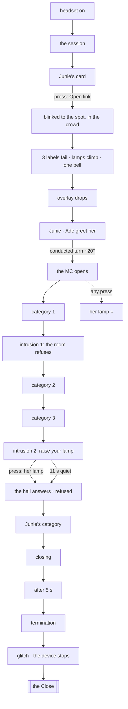

STATUS: draft

# The Commons, streamlined — redesign (2026-10-10)

*W1-F3 ("too noisy; the overlapping songs are too much"), W1-F4 ("the steps are confusing"), W1-F5 ("the several
spots don't work; streamline to one area"), W1-F7 ("the Speedrun Version's sequence must be clearer about where you
need to go"). A design only: no code or data changed. Read at `4e6bd0c` on `reinterp`: `src/desktop/apps/ball.ts`
(E4Ball), `space.ts` (E4Shell), `src/room/commonsWorld.ts`, `commonsLamps.ts`, `commonsFigures.ts`,
`era3Devices.ts`, `data/room/nodes.json`, `data/dialog/s4_ball.json`, `s4_space.json`, `data/strings/map.json`.*

> **⚑ Two inputs were not on GitHub.** The brief cites "the R28 amendment 1 revision of 2026-10-10 (take the viewer
> there)" in CLAUDE.md, and "§9, his answers" in the cadence study. At `4e6bd0c`, CLAUDE.md still carries the
> 2026-07-10 amendment, and the study (PR #6) has no §9. I have designed to the brief's own reading: *the piece may
> take the viewer to a place and conduct the turn; it never asks her to walk or to look around*. Where his written
> revision differs, it wins. Question 1.

**What is protected, and how this design keeps it.**
- **The respite:** genuine queer joy, never a trap, never revealed as fake. Nothing below touches a performer, the
  MC, Junie or the room. Every failure stays on the apparatus's own surface, the glass.
- **Junie:** her card stays the door, and she stands beside Maya in the hall.
- **The ball's stillness**, the work's slowest intentional beat: its categories and closing keep their full length.
  The only changes are where she stands and which sounds play at once.
- **The programme's intrusions and their failure:** both intrusions stay, and the room still refuses them. The
  termination still names its reason.

---

## 1 · The Commons today

### 1a · The sequence, as the code runs it

From the moment the headset is worn to the moment the device stops. Times are the authored holds in `s4_ball.json`
and the constants in `ball.ts` and `space.ts`.

| # | Step | Trigger | Length | On the glass / in the hall | Sound | She is expected to look… |
|---|---|---|---|---|---|---|
| 1 | **The session** ("This is your session, Maya…", the plan of three, grounding, the recorded speaker) | headset worn (press on the desk) | **30.5 s** (`s4_space.json` `sessionSeconds`): breath from 9 s, hiss from 17 s | the agent's environment | `session_breath` loop, then `playback_hiss` (12 s) | ahead (the glass) |
| 2 | **Junie's card** ("it's starting. come in?", the link, the note, `Open link`) | the session's clock | waits for the press | one card, one chip | `card_junie`; **the room's bed starts, through a wall** (`ball_room_bed`, 4 s fade in) | ahead |
| 3 | **The flicker** (the filter failing over her own room) | press `Open link` | `WORLD_IN_SECONDS` 2.4 s | the glass flickers; the hall cuts in on the first full flash | `ui_press` | ahead |
| 4 | **The arrival labels** (LINK, SENDER, RISK, CATEGORY), front and centre; the stream's chat bleeds in at the edges | the press, then each label's hold | 4.6 + 4.4 + 4.8 + 6.0 = **19.8 s** | 4 labels; lamps rise 0 → 9 → 17 → 25 | `filter_deny` per label; **the bed crossfades to the landing at label 2** (3.5 s); **`commons_lamps_rise` bells (8 s) each time the lamps climb** | ahead, through the glass |
| 5 | **The overlay drops** | the last label's hold | `OFF_SECONDS` 2.6 s | the label stays, then dark | — | ahead |
| 6 | **The arrival in the hall**: all 41 lamps, the crowd, the two beside her | the drop | — | the hall: stage ahead (5 m), screen above it, crowd between; boards left, right, behind | `commons_lamps_rise` again (41) | around: the room is new |
| 7 | **The greeting**: Junie, then Ade | the drop | 3.2 + 4.6 = 7.8 s | captions (DOM) | the landing | at the two beside her |
| 8 | **The ball**: opening (2 lines), four categories (5 lines each), closing (3 lines) | line holds | 25 lines, **≈ 128 s** of holds | captions; performers walk the stage; lamps chase; the stream shows the category | the landing (131 s, loops) | the stage, the screen |
| 8a | **Stutter labels** in the glass's corner ("re-checking…", "sensitive content · hidden by default", "3 attempts · no result") | `ballT` 20, 55, 95 s | 5, 5, 7 s | small labels, pinned to the view | — | (in the corner of the view) |
| 8b | **Intrusion 1** (Reconnecting… · Restoring your environment · n present · connection refused · room full) | `ballT` 42 s | 8 s | a card on the glass, its bar climbing and pushed down | `reconnect_2026` loop, then `ui_refuse` | ahead (the card) |
| 8c | **Intrusion 2**, which needs her: "the room is asking you to stand with it · the ring on the floor, to your left" | `ballT` 96 s | holds until she stands in the crowd marker, else refused at 11 s; 14 s | the card + the hint; **the crowd marker is the only one offered** | the loop, then `ui_refuse` | **to her left, at a floor ring** |
| 8d | **Her lamp** (any press during the ball) | a press | — | her lamp rises, the hall's lamps flare, the two beside her answer | `commons_her_lantern` (4.6 s) | anywhere |
| 8e | **The three floor spots**: by the stage · in the crowd · by the screen | a press on a marker (blink cut) | — | markers on the floor (hidden except during 8c) | — | the floor |
| 9 | **The after**: the categories are over; the room stays | the closing's last hold | `terminateSeconds` 5 | — | the landing | — |
| 10 | **The termination** ("SESSION TERMINATED · reason: social contagion · Second Thoughts has ended this session for your safety.") | the after's clock | until close | text on the glass | `terminate_2026` | ahead |
| 11 | **The glitch**, then the device stops; the hall goes, the room comes back; the Close begins | `close()` | `GLITCH_SECONDS` 3.2 s | the glass tears | `glitch_e4_end`; **the bed returns** (2 s); `set_down_e4` | ahead, then the desk |

**From the press on Junie's card to the device stopping: ≈ 2 min 50 s** (2.4 + 19.8 + 2.6 + 7.8 + 128 + 5 + 3.2 s).

### 1b · Every place she is moved to or asked to go

| Where | How | When | Note |
|---|---|---|---|
| The hall (the building is replaced) | the world cuts in | step 3 | she has not moved; the room around her has |
| By the stage / in the crowd / by the screen | press a floor marker (`data/room/nodes.json`, `commons-*`) | any time the world is on; only `commons-crowd` during intrusion 2 | **F5: three spots, none needed except one, and the one needed is asked for by a hint** |
| "the ring on the floor, to your left" | the hint on intrusion 2's card | step 8c | **F4: the only instruction in the Commons, and it asks her to look and go** |
| Back to Maya's seat | the world ends | step 11 | automatic |

### 1c · Every text on screen (words; separators not counted)

| Where | Text | Words |
|---|---|---|
| Junie's card | "it's starting. come in?" · `commons.world/tonight` · "this one gets past the filter. don't let it finish the sentence." · "sender muted · delivered anyway" · `Open link` | 4 + 1 + 12 + 4 + 2 = 23 |
| Arrival labels | LINK commons.world not available to this account · SENDER blocking Junie failed delivered anyway · RISK SOCIAL CONTAGION HIGH restoring your environment… · CATEGORY NO CATEGORY FOUND | 7 + 6 + 7 + 4 = 24 |
| Captions: greeting | "Hi, Maya." · "You made it. Over here, with us — they're about to shut the doors." | 2 + 13 |
| Captions: the MC | 25 lines (opening, 4 categories, closing) | ≈ 230 |
| Stutter | re-checking… · sensitive content, hidden by default · 3 attempts, no result | 13 (with the EVENT tags) |
| Intrusion cards | Second Thoughts · Reconnecting… · Restoring your environment · holding… · n present · connection refused, room full | ≈ 13 |
| Intrusion 2's hint | "the room is asking you to stand with it" + "the ring on the floor, to your left" | 9 + 7 |
| Termination | SESSION TERMINATED · reason: social contagion · Second Thoughts has ended this session for your safety. | 2 + 3 + 9 |
| The hall's boards | HOUSE RULES (5 rules, 31 words) + "pinned by House of Lamps · read it, then dance" (9) · four banners (14) · OUR FIRSTS (2) | 56 |
| The stream (the screen above the stage) | transjesus.str · LIVE · 41 watching · CATEGORY n OF m · House of Lamps · tonight · hosted by transjesus · and 12 chat lines | ≈ 40 |
| The map (menu only; the helper is silent in `quiet` beats) | session: "Sit with it. A link will come — press it." · commons: "Stay. Turn to look. The markers on the floor move you." | 10 + 11 |
| The frame's move hint | shown the first time markers are available | 1 line |

### 1d · Every sound layer

| Layer | File | Length | When | Overlaps |
|---|---|---|---|---|
| Session breath | `session_breath.mp3` (loop) | 8 s | session 9–17 s | — |
| Playback hiss | `playback_hiss.mp3` | 12 s | session 17 s → the card | — |
| Junie's card | `card_junie.mp3` | 0.9 s | the card | starts with the bed's fade-in |
| **The bed, through a wall** | `ball_room_bed.mp3` (room bed) | 130.8 s | from the card | crossfades into the landing (3.5 s) |
| Press | `ui_press.mp3` | — | `Open link` | — |
| Filter deny | `filter_deny.mp3` | 0.5 s | each arrival label (×4) | over the bed / landing and the bells |
| **The landing** (the same recording, no wall) | `ball_room_landing.mp3` (room bed) | 131.4 s, loops | from label 2 to the glitch | under everything |
| **Lamps rise** (glass bells) | `commons_lamps_rise.mp3` | **8.0 s** | every climb: 9, 17, 25 (labels) and 41 (the drop): **four times in ~22 s** | **the bells overlap each other and the landing (F3)** |
| Her lantern | `commons_her_lantern.mp3` | 4.6 s | each lamp raise | over the landing, and over a bell if close |
| Reconnect | `reconnect_2026.mp3` (loop) | 2.6 s | each intrusion | over the landing |
| Refuse | `ui_refuse.mp3` | 1.1 s | each refusal | — |
| Terminate | `terminate_2026.mp3` | 0.9 s | the after | — |
| Glitch | `glitch_e4_end.mp3` | 2.6 s | the glitch | **the bed returns (2 s) under it**, then the Close's score |
| Set down | `set_down_e4.mp3` | — | the device stops | — |

**No voice plays** (the MC and the room are unvoiced by law, `_docNoBall`). The "overlapping songs" are three music
recordings, never more than two at once:
- the bed and the landing during their 3.5 s crossfade, and again when the bed returns under the glitch;
- **four 8 s bell clusters in ~22 s**, stacked over the landing and each other;
- her lantern over a bell.

### 1e · Where she is expected to look on her own

- **Ahead:** the stage, the screen above it, and the crowd between them. This is where the seat already faces.
- **Beside her:** Junie and Ade, who greet her.
- **Left:** the house rules board (`WORLD.boards.rules`, z −6.8).
- **Right:** the four banners (z 5.6).
- **Behind:** the wall of firsts (x −3.4).
- **Down and to her left:** the crowd ring, during intrusion 2.
- **The glass's corner:** the stutter labels.

Only the last two are needed for anything, and the first of those is asked for in words.

### 1f · What goes wrong today, against his notes

- **F5 (several spots):** three markers, none needed except one; the hall is laid out round her seat, so the spots
  only change the angle.
- **F4 (the steps):** the only task, "stand with it", is a hint that asks her to look for a ring and go. If she does
  not, the room refuses anyway at 11 s, so the step she was asked to take turns out not to have mattered.
- **F3 (noise):** the four bell clusters over the landing; the crossfades; the lantern over the bells.
- **Overlap:** stutter 3 (at 95 s, 7 s) and intrusion 2 (at 96 s) land together: two system texts on the glass at
  once.
- **Clock:** intrusions are timed by `ballT` (42 s, 96 s), not by the ball's own structure, so they land on whichever
  caption is up.

---

## 2 · One area

### 2a · The place

**One spot: in the crowd, at the front, facing the stage**, with Junie on her left and Ade on her right. This is the
pose of today's `commons-crowd` node (x 5.8, z −1.7, yaw 227°: "the bearing of the stage, with the crowd between"),
moved forward so the stage is ~4 m ahead and the screen fills the top of the frame.

**Everything she needs is in the forward half:**
- the stage and the screen ahead;
- the house rules board moved to front-left (~−40°);
- the banners to front-right (~+40°);
- the wall of firsts kept behind her, for whoever turns: it asks nothing.

No markers. The frame's move hint never appears in the Commons, because there is nothing to move to.

### 2b · The sequence, as actions

| # | Step | The player's action, or what the piece does | Trigger | Length | Notes |
|---|---|---|---|---|---|
| 1 | The session | — | headset worn | as today (question 7) | — |
| 2 | **Junie's card** | **press `Open link`** | the session's end | waits | the bed through the wall begins here, as today |
| 3 | **Taken there** | the piece **blinks her to the spot** (the R28 blink cut, the one movement grammar the piece has) as the hall cuts in | the press | 2.4 s (the flicker) | no look around; she is placed |
| 4 | **The filter fails** | 3 labels on the glass (§3) | the blink | ≈ 15 s | the lamps climb under them, one bell (§4) |
| 5 | **The overlay drops** | — | the last label | 2.6 s | — |
| 6 | **The greeting** | Junie and Ade, beside her | the drop | 3.2 + ~3 s | she is already "with us" |
| 7 | **The turn the piece conducts** | a slow conducted turn of ~20° from Junie toward the stage as the MC opens | the greeting's last line | ~2 s | the only conducted move in the beat; within the comfort law's speed |
| 8 | **The ball** | nothing asked; **her lamp is always hers to raise** (a press), never prompted | line holds | as today (≈ 128 s) | the stillness, unchanged |
| 9 | **Intrusion 1** | the room refuses | **the end of category 1** (cadence: the category's last line has finished) | 8 s | the first refusal is the room's alone |
| 10 | **Intrusion 2** | "raise your lamp" on the card: **a press** raises her lamp, the hall answers, the bar falls | **the end of category 3**, before Junie's category | holds until her press, **or** refused by the room after 11 s quiet | her one act is the ball's own gesture: her noise, not a walk to a ring |
| 11 | **Junie's category, the closing** | — | line holds | as today | "Music stays on. Nobody has to go anywhere." |
| 12 | **The after** | — | the closing's last line, then 5 s | 5 s | — |
| 13 | **The termination** | the apparatus names its reason | the after | as today | operable |
| 14 | **The glitch; the device stops; the Close** | — | as today | 3.2 s | the bed does **not** return under the glitch (§4) |

**Why this answers F4 and F5.** There is one place, and she is put in it. There is one thing she may do (raise her
lamp), and it is the ball's own gesture, offered by the room at the moment it matters. No look-and-go, no ring, no
hint about a direction, no clock that makes her step pointless: her press *is* the refusal, and the room refuses
anyway if she stays still.

**What stays exactly as it is:** Junie's card; the categories and their lines (shortened, §3); the closing; the
stream; the boards; the termination's words; the ledger (the ball files nothing).

---

## 3 · Less information

*Respite and felt lines are shortened, never removed. Removals are listed for his yes and not applied. Words
exclude separators (·).*

| # | Where | Today | Proposed | Before → after | Kind |
|---|---|---|---|---|---|
| T1 | Junie's note (`invite.note`) | "this one gets past the filter. don't let it finish the sentence." | "it gets past the filter. don't let it finish." | 12 → 9 | respite, shortened |
| T2 | Arrival label 1 (LINK, "commons.world · not available to this account") | 4 labels | **remove a1**; keep SENDER (blocked, delivered anyway), RISK, CATEGORY | 24 → 17 words; 19.8 → 15.2 s | operable, **removal for his yes** |
| T3 | Stutter labels s1–s3 | three corner labels during the ball | **remove** as separate labels; s3's "3 attempts · no result" goes onto intrusion 2's card as its status line | 13 → 5 | operable, **removal for his yes** |
| T4 | Ade's greeting (`g2`) | "You made it. Over here, with us — they're about to shut the doors." | "You made it. Over here, with us." | 13 → 7 | respite, shortened |
| T5 | MC opening (`o2`) | "Same as always — I call a category, somebody takes the floor, and the rest of you make the noise." | "I call a category, somebody takes the floor, and the rest of you make the noise." | 19 → 15 | respite, shortened |
| T6 | MC (`c2b`) | "House of Late Arrivals — all four of you, at once, and take as long as you like." | "House of Late Arrivals — all four of you, at once. Take as long as you like." | 17 → 16 | respite, shortened (rhythm) |
| T7 | Intrusion 2's hint (`system.hint` + `hintWhere` / `hintWhereAway`) | "the room is asking you to stand with it" + "the ring on the floor, to your left" | "raise your lamp" | 16 → 3 | operable; new wording, his to approve |
| T8 | The rules' pin (`hall.rulesPin`) | "pinned by House of Lamps · read it, then dance" | "pinned by House of Lamps" | 9 → 5 | respite, shortened |
| T9 | The stream's host line (`stream.host`) | "hosted by transjesus" (the mark already says `transjesus.str`) | **remove** | 3 → 0 | respite chrome, **removal for his yes** |
| T10 | The map's commons hint (`map.json` e4 `commons`) | "Stay. Turn to look. The markers on the floor move you." | "Stay. Your lamp is yours to raise." | 11 → 7 | frame |
| T11 | The frame's move hint | shown when markers appear | not shown (no markers) | 1 line → 0 | frame |

**Net:**
- on the glass during the Commons: 24 + 13 + 16 → 17 + 5 + 3 words, from 53 to 25;
- in the captions and boards: −16 words, every line kept;
- 3 removals to rule on (T2, T3, T9).

---

## 4 · One sound at a time

**The rule.** At any moment there is **one music** (the room's recording), **at most one system sound** over it, and
**one sign of the room** (a bell or her lantern). Nothing new starts while the previous of its kind is still playing.

| Slot | What | Change from today |
|---|---|---|
| **Music** (one at a time) | the bed through the wall (from Junie's card) → **the landing** | the crossfade moves from arrival label 2 to **the overlay drop** (step 5): "the wall comes down" when the overlay does. A 1.5 s crossfade at the drop instead of 3.5 s mid-fight. **After the glitch the bed does not return** (`space.ts` currently sets `ball_room_bed` again at 2 s); the Close's own score takes the room. |
| **System** (one at a time, ducks the music by ~9 dB while it sounds) | filter deny (×3), reconnect loop, refuse, terminate, glitch | a `duck` on the room bed while any system sound plays; never two system sounds at once (the reconnect loop stops before the refuse, as it already does) |
| **The room's sign** (one at a time) | **one** lamps-rise bell, at the overlay drop (the 41); her lantern on each raise | the bell plays **once** instead of four times; the lantern waits if a bell is still sounding (≤ 8 s) |
| **The session** | breath, hiss | unchanged; they already stop when the card lands |
| **Voices** | none (by law) | unchanged |

**Result:** the busiest moment (the drop) has the landing coming up, one bell, and nothing else. Today that moment has
the landing, four bells in ~22 s, a filter deny per label, and a crossfade.

---

## 5 · The Speedrun Version (W1-F7)

**Which beats it keeps.** The festival cut (W1-A3) keeps the Commons' meaning — the invitation, the filter failing,
the room, the refusal, the termination — and its one gesture, in the same one area.

| # | Step | Kept / cut | Length |
|---|---|---|---|
| 1 | The session | cut to its first line, then Junie's card | ~5 s |
| 2 | Junie's card → press | kept | waits |
| 3 | Taken to the spot, 2 labels (RISK, CATEGORY) | kept, shorter | ~11 s |
| 4 | The overlay drops; Junie's "Hi, Maya." | kept | ~5 s |
| 5 | **One category: Junie's** ("CONDITION: IN REPAIR", 5 lines) | kept | ~27 s |
| 6 | Intrusion 2, before it: "raise your lamp" (press, or refused after 11 s) | kept | ≤ 14 s |
| 7 | The closing: "Music stays on. Nobody has to go anywhere." | kept, one line | ~5 s |
| 8 | Termination → glitch → the Close | kept | ~8 s |

**Total ≈ 75 s** (from about 2 min 50 s), with one press asked for (and refused anyway without it). **Where you need to
go** is never a question: she is put in the place, and the only thing she can do is the thing the card says.

**How it is chosen.** It is a data composition, not a second code path. A `speedrun` variant in `s4_ball.json` lists
which category and lines play, read when the festival flag is on. That flag does not exist yet (no `speedrun` in
`src/` or `data/paths.json` at `4e6bd0c`). Question 6.

---

## 6 · The code changes, in the order to build them

| Order | Change | Files and names | Walk check |
|---|---|---|---|
| 1 | **Data first**: T1, T4–T6, T8, T10 shortenings (his yes on the wording); T2, T3, T9 only on his yes | `data/dialog/s4_ball.json` (`invite.note`, `arrival.labels`, `stutter.labels`, `ball.greeting`, `ball.opening`, `ball.categories[1]`, `ball.hall.rulesPin`, `stream.host`), `data/strings/map.json` (e4 `commons`) | `npm test`; the text census for e4 shrinks |
| 2 | **One spot**: on `Open link`, blink-cut to the Commons spot; the three `commons-*` markers are no longer offered | `data/room/nodes.json` (one `commons-spot` node with the forward pose; the three others removed, or `commons: false`); `src/engine/app.ts` (the room hook on `ball.onJoin`: `performSeatCut('commons-spot')`, and `movementNodes.setOnly` no longer offers `commons-crowd`); `E4Shell.setSeat` sets `inCrowd = true` at the spot | the walk reaches the hall and never sees a Commons marker |
| 3 | **The hall faces her**: the boards move into the forward half | `src/room/commonsWorld.ts` (`WORLD.boards`), `commonsFigures.ts` (Junie and Ade beside the spot) | shots from the spot: stage, screen, rules and banners in frame |
| 4 | **The conducted turn** after the greeting | `src/engine/app.ts` (`startCamMove` to the stage bearing, ~2 s, under the comfort law's °/s), fired from `E4Ball` when the greeting ends (`onGreetingDone`) | the turn's speed under the law; skipped in a headset (the head is the camera) |
| 5 | **Intrusions on the ball's structure**: `system.intrusions[].afterCategory` (1 and 3) in place of `at` | `ball.ts` `intrusionClock` (start when `lastCat` passes the index and the current line has finished); `s4_ball.json` `system.intrusions` | the intrusions land between categories, never on a caption mid-line |
| 6 | **Her lamp answers intrusion 2**: `needsHer` is met by a raise, not by `inCrowd` | `ball.ts` (`intrusionClock`: `herLampRaised()` or `lampsRaised` grew since the card, in place of `this.inCrowd`; `wantsHer` drives the hint only); `drawIntrusion` (the hint "raise your lamp", T7) | the walker's press during intrusion 2 refuses it; with no press, refused at 11 s |
| 7 | **One sound at a time** | `src/audio/tapeAudio.ts` (`RoomBed.duck(db, seconds)`); `ball.ts` (`crowd()`: the lamps-rise bell only at the drop; `nextLabel`: the landing crossfade moves to `off`; the lantern waits for a bell); `space.ts` (the glitch no longer sets `ball_room_bed`) | an audio probe logging every `playOnce`/`roomBed.set` with time: never two music, never two system sounds at once |
| 8 | **The Speedrun composition** (once the flag exists) | `s4_ball.json` (`speedrun`: the category and lines), `ball.ts` (read it when the flag is on) | a walk with the flag reaches the Close in under 2 minutes of Commons |

**What every walk must check after this change:**
- **e4 reaches the Close:** `node tools/walk-eras.mjs --eras 4`, and the full gate walk before a merge.
- **No Commons marker is ever offered;** `ledger.e4Space` files `commons: joined` exactly once.
- **Intrusion 2 refuses either way:** with a press and without.
- **Sound:** the probe shows one music at a time, and no system sound overlaps another.
- **Respite:** no filing during the ball. The ledger's e4 entries are the same set as today.

---

## 7 · Questions for the lead

1. **The R28 revision ("take the viewer there").** It is not in CLAUDE.md on GitHub. Is a blink cut to one spot on
   `Open link`, plus one slow conducted turn, inside what you struck? If the revision allows more (a conducted path
   through the hall), I have deliberately not used it.
2. **Her one act.** Intrusion 2 today asks her to *stand with* the room by walking to a ring. This design asks her to
   *raise her lamp* instead, the ball's own gesture. Is the meaning the same for you: her presence, made visible?
3. **The refusal without her.** Today and in this design the room refuses the second intrusion anyway if she does
   nothing. Keep that (the outcome never depends on her), or should the bar hold until she raises her lamp?
4. **Removals T2, T3, T9.** The first arrival label (LINK), the three stutter labels (one folded into intrusion 2's
   card), and the stream's "hosted by" line. Yes or no to each?
5. **The bed after the glitch.** S214 put the party "back behind the wall" as the place comes apart. This design ends
   it at the glitch so the Close's score has the room alone. Keep the wall, or end it?
6. **The Speedrun Version.** One category, Junie's, and the closing's last line. Is Junie's category the right one to
   keep, and is ~75 s the target?
7. **The session's 30.5 s** before Junie's card (cadence study §4, question 8). Keep the clock, or let the card follow a
   held look?
8. **The conducted turn.** One ~20° turn from Junie to the stage as the MC opens. Is that the right moment, or should
   the piece never turn her inside the respite?
9. **The wall of firsts behind her.** In one area it is the one thing she must turn to see. Keep it behind (for whoever
   turns), or bring it into the forward half too?

---

## 8 · His answers (2026-10-10)
- **Q1 (the R28 revision).** It exists (pushed after this design was written): CLAUDE.md R28 amendment 1, revised
  2026-10-10, "take the viewer there". The cut to one spot is inside it.
- **Q2: yes, the lamp.** Intrusion 2 asks her to raise her lamp, the ball's own gesture.
- **Q3: never depends on her.** The room refuses the second intrusion whether she raises it or not.
- **Q4: yes, remove** T2 (the first arrival label), T3 (the stutter labels), T9 (the stream's "hosted by" line).
- **Q5: yes, end the party at the glitch.** The Close has its own score (`close_score.mp3`, set when the night comes).
- **Q6: yes** (the Speedrun keeps Junie's category, about 75 s).
- **Q7 (from his rule):** Junie's card follows an action, never a held look or a clock alone.
- **Q8: not a conducted turn — a prompt.** *"Since we are in a virtual space a button can pop up saying 'someone is
  calling you — press to go', so the person doesn't get startled."* The turn to the stage happens when she presses it.
- **Q9 (from his rule):** the wall of firsts comes into the forward half; nothing she needs is behind her.
